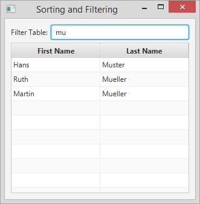

+++
title = "JavaFX 8 TableView Sorting and Filtering"
date = 2014-04-30
updated = 2015-04-15
image = "tableview-sorting-filtering.png"
description = "The JavaFX 8 SortedList and FilteredList allow easy sorting and filtering of data in a TableView." 
prettify = true
comments = true
tags = [ "Java", "JavaFX" ]
+++

JavaFX 8 comes with two new classes, [SortedList](http://docs.oracle.com/javase/8/javafx/api/javafx/collections/transformation/SortedList.html) and [FilteredList](http://docs.oracle.com/javase/8/javafx/api/javafx/collections/transformation/FilteredList.html). In JavaFX 2 we had to manually do the filtering as I've described in [an earlier post](/blog/javafx-2-tableview-filter/).

So, let's see how we can use the new classes to sort and filter a [TableView](http://docs.oracle.com/javase/8/javafx/api/javafx/scene/control/TableView.html).

## Example Setup

As an example we'll create a simple table that displays `Person`s. The table should be filtered whenever the user enters something in the text field. 

### The Files

The example contains four files. You can look at each file individually or download the [entire source as an Eclipse project](tableview-sorting-filtering.zip).

* [Main.java](Main.java) - class to start the application
* [Person.java](Person.java) - model class
* [PersonTable.fxml](PersonTable.fxml) - user interface defined in fxml
* [PersonTableController.java](PersonTableController.java) - view-controller class

We will only take a closer look at the `PersoTableController` as this is where the sorting and filtering takes place.

## Sorting and Filtering Explained

For the sorting and filtering to work, we need to wrap an `ObservableList` in a `FilteredList` and then in a `SortedList`. 

Let's take a look at the code: 

#### PersonTableController.java

<pre class="prettyprint lang-java">
package ch.makery.sortfilter;

import javafx.collections.FXCollections;
import javafx.collections.ObservableList;
import javafx.collections.transformation.FilteredList;
import javafx.collections.transformation.SortedList;
import javafx.fxml.FXML;
import javafx.scene.control.TableColumn;
import javafx.scene.control.TableView;
import javafx.scene.control.TextField;

/**
 * View-Controller for the person table.
 * 
 * @author Marco Jakob
 */
public class PersonTableController {
	
	@FXML
	private TextField filterField;
	@FXML
	private TableView&lt;Person> personTable;
	@FXML
	private TableColumn&lt;Person, String> firstNameColumn;
	@FXML
	private TableColumn&lt;Person, String> lastNameColumn;

	private ObservableList&lt;Person> masterData = FXCollections.observableArrayList();

	/**
	 * Just add some sample data in the constructor.
	 */
	public PersonTableController() {
		masterData.add(new Person("Hans", "Muster"));
		masterData.add(new Person("Ruth", "Mueller"));
		masterData.add(new Person("Heinz", "Kurz"));
		masterData.add(new Person("Cornelia", "Meier"));
		masterData.add(new Person("Werner", "Meyer"));
		masterData.add(new Person("Lydia", "Kunz"));
		masterData.add(new Person("Anna", "Best"));
		masterData.add(new Person("Stefan", "Meier"));
		masterData.add(new Person("Martin", "Mueller"));
	}

	/**
	 * Initializes the controller class. This method is automatically called
	 * after the fxml file has been loaded.
	 * 
	 * Initializes the table columns and sets up sorting and filtering.
	 */
	@FXML
	private void initialize() {
		// 0. Initialize the columns.
		firstNameColumn.setCellValueFactory(cellData -> cellData.getValue().firstNameProperty());
		lastNameColumn.setCellValueFactory(cellData -> cellData.getValue().lastNameProperty());
		
		// 1. Wrap the ObservableList in a FilteredList (initially display all data).
		FilteredList&lt;Person> filteredData = new FilteredList&lt;>(masterData, p -> true);
		
		// 2. Set the filter Predicate whenever the filter changes.
		filterField.textProperty().addListener((observable, oldValue, newValue) -> {
			filteredData.setPredicate(person -> {
				// If filter text is empty, display all persons.
				if (newValue == null || newValue.isEmpty()) {
					return true;
				}
				
				// Compare first name and last name of every person with filter text.
				String lowerCaseFilter = newValue.toLowerCase();
				
				if (person.getFirstName().toLowerCase().contains(lowerCaseFilter)) {
					return true; // Filter matches first name.
				} else if (person.getLastName().toLowerCase().contains(lowerCaseFilter)) {
					return true; // Filter matches last name.
				}
				return false; // Does not match.
			});
		});
		
		// 3. Wrap the FilteredList in a SortedList. 
		SortedList&lt;Person> sortedData = new SortedList&lt;>(filteredData);
		
		// 4. Bind the SortedList comparator to the TableView comparator.
		sortedData.comparatorProperty().bind(personTable.comparatorProperty());
		
		// 5. Add sorted (and filtered) data to the table.
		personTable.setItems(sortedData);
	}
}
</pre>

#### The steps explained

##### 1. Wrap the ObservableList in a FilteredList

To allow filtering we must wrap our `masterData` in a `FilteredList`. The `FilteredList` filters the list depending on a specified `Predicate`. The initial `Predicate` is always true: `p -> true` (yes, this is a Java 8 lambda expression).

##### 2. Set the filter Predicate whenever the filter changes

As a second step we add a `ChangeListener` to the filter text field. Whenever the user changes the text, the `Predicate` of our `FilteredList` is updated. 

In this example I'm using a filter that matches whenever `firstName` or `lastName` contains the filter String.

##### 3. Wrap the FilteredList in a SortedList

`FilteredList` is unmodifiable, so it cannot be sorted. We need to also wrap it in `SortedList` for this purpose. 

##### 4. Bind the SortedList comparator to the TableView comparator

A click on the column header changes the sorting of the `TableView`. But now that we have a separate `SortedList` we must bind the sorting of that list to the `TableView`. Notice that the `TableView` will return back to the original, unsorted state after three clicks on the column header (this was not the case in JavaFX 2).

##### 5. Add sorted (and filtered) data to the table

As a last step we set the sorted and filtered data as items into the `personTable`.

*****

## Conclusion

Sorting and filtering has become more convenient in JavaFX 8. But not everything is straight forward: double-wrapping a list, binding a Comparator, and creating a lambda expression inside another lambda expression are things that are not all too common.
