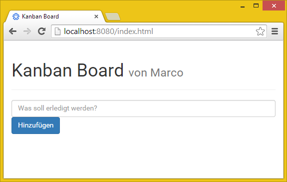
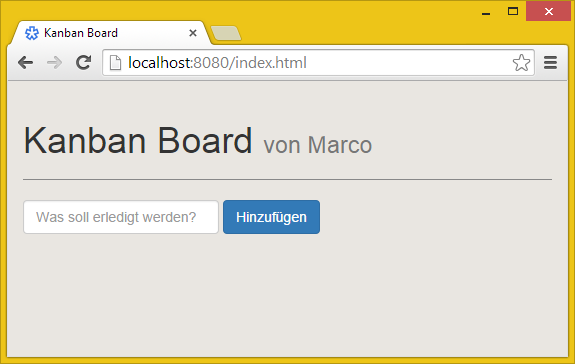
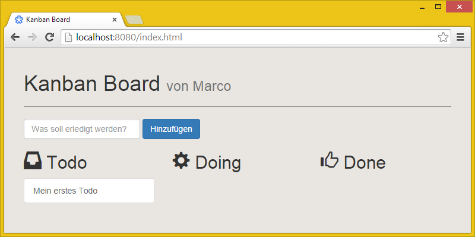

+++
title = "Teil 2: HTML vorbereiten"
date = 2015-03-23
image = "columns.de.png"
description = "Das Kanban Board in der HTML-Datei vorbereiten. Drei Spalten mit dem Bootstrap-Raster erstellen."
prettify = true
comments = true
commentsIdentifier = "/library/dart-kanban/de/part2/"
aliases = [ 
  "/library/dart-kanban/de/part2/" 
]

pagingName = "2"
weight = 3

[[sidebars]]
header = "Source Code"

[[sidebars.items]]
text = "<i class=\"fa fa-fw fa-github-alt\"></i> Beispielcode auf GitHub"
link = "https://github.com/marcojakob/tutorial-dart-kanban"
+++

Unser Ziel ist eine **dymanische Webapplikation**: Der Benutzer soll direkt Änderungen vornehmen können. Es gibt aber auch Teile unserer Webapplikation, die statisch sind und sich somit nicht verändern werden (wie zum Beispiel der Titel "Kanban Board").

Es wäre zwar möglich, alles HTML, auch das statische, aus dem Dart-Code heraus zu generieren. Meistens ist es aber einfacher, gewisse Teile in der HTML-Datei bereits zu definieren. Wir werden deshalb die ganze Grundstruktur vom Kanban Board im HTML vorbereiten.

## Textfeld und Knopf

Zuerst erstellen wir ein Textfeld (Input) und einen Knopf (Button). Öffnen Sie die `index.html` und ergänzen Sie ihren Code mit dem gelb markierten Zeilen.

<pre class="prettyprint lang-html">
&lt;div class="page-header">
  &lt;h1>Kanban Board &lt;small id="subtitle">&lt;/small>&lt;/h1>
&lt;/div>

<mark>&lt;input id="todo-input" type="text" class="form-control" placeholder="Was soll erledigt werden?">
&lt;button id="todo-button" type="button" class="btn btn-primary">Hinzufügen&lt;/button></mark>
</pre>

*Achten Sie darauf, dass Sie die zwei Code-Zeilen an der richtigen Stelle einfügen.*

### Styling

Wir verwenden Bootstrap-Klassen für das [Input-Element](https://getbootstrap.com/docs/4.1/components/forms/) und für den [Button](https://getbootstrap.com/docs/4.1/components/buttons/).

Standardmässig werden die Textfelder in Bootstrap auf der ganzen Breite angezeigt. Wir möchten jedoch, dass der Knopf schön neben dem Textfeld positioniert wird.

Solche Anpassungen können wir in der zugehörigen CSS-Datei vornehmen. Öffnen Sie also die Datei `styles/main.css`, löschen Sie den generierten Code und ersetzen Sie ihn mit folgendem CSS:

<pre class="prettyprint lang-css">
body {
  background-color: #e9e6e1;
}

.page-header {
  border-bottom: 1px solid #888;
}

#todo-input {
  display: inline-block;
  width: auto;
  vertical-align: middle;
}
</pre>

Die beiden ersten Regeln verändern die Farbe des Hintergrunds und der feinen Linie. Sie können natürlich eine beliebige Farbe wählen.

Bei der dritten Regel sprechen wir das Textfeld an über die ID `todo-input`. Darin geben wir an, dass es nicht die gesamte Breite einnehmen soll.

## Drei Spalten - Todo, Doing, Done

Als nächstes brauchen wir die drei Spalten für unser Kanban Board: *Todo*, *Doing* und *Done*.

Dafür empfielt es sich das Bootstrap-Raster zu verwenden. Im Artikel über [Website-Layout](/library/more-html-css/de/website-layout/) erkläre ich ausführlich, wie das Bootstrap-Layout verwendet werden kann.

Der fertige Code in `index.html` sieht mit den drei Spalten wie folgt aus:

<pre class="prettyprint lang-html">
&lt;!DOCTYPE html>

&lt;html>
  &lt;head>
    &lt;meta charset="utf-8">
    &lt;meta http-equiv="X-UA-Compatible" content="IE=edge">
    &lt;meta name="viewport" content="width=device-width, initial-scale=1.0">
    &lt;link rel="stylesheet" href="https://maxcdn.bootstrapcdn.com/bootstrap/3.3.4/css/bootstrap.min.css">
    &lt;link rel="stylesheet" href="styles/main.css">

    &lt;title>Kanban Board&lt;/title>
  &lt;/head>

  &lt;body>
    &lt;div class="container">
      &lt;div class="page-header">
        &lt;h1>Kanban Board &lt;small id="subtitle">&lt;/small>&lt;/h1>
      &lt;/div>

      &lt;input id="todo-input" type="text" class="form-control" placeholder="Was soll erledigt werden?">
      &lt;button id="todo-button" type="button" class="btn btn-primary">Hinzufügen&lt;/button>

<mark>      &lt;div class="row">
        &lt;div class="col-sm-4">
          &lt;h2>&lt;span class="glyphicon glyphicon-inbox">&lt;/span> Todo&lt;/h2>
          &lt;div id="todo-list" class="list-group">
            &lt;a href="#" class="list-group-item">Mein erstes Todo&lt;/a>
          &lt;/div>
        &lt;/div>
        &lt;div class="col-sm-4">
          &lt;h2>&lt;span class="glyphicon glyphicon-cog">&lt;/span> Doing&lt;/h2>
          &lt;div id="doing-list" class="list-group">
          &lt;/div>
        &lt;/div>
        &lt;div class="col-sm-4">
          &lt;h2>&lt;span class="glyphicon glyphicon-thumbs-up">&lt;/span> Done&lt;/h2>
          &lt;div id="done-list" class="list-group">
          &lt;/div>
        &lt;/div>
      &lt;/div>
      &lt;/div></mark>

    &lt;script type="application/dart" src="main.dart">&lt;/script>
    &lt;script data-pub-inline src="packages/browser/dart.js">&lt;/script>
  &lt;/body>
&lt;/html>
</pre>

#### Erklärungen

Das Layout enthält eine Zeile mit Klasse `row` und für Spalten mit Klasse `col-sm-4`. Bootstrap sorgt dafür, dass die Spalten bei kleinen Bildschirmen untereinander angezeigt werden.

In jeder Spaltenüberschrift verwenden wir ein Icon. Die [Glyphicons](http://holdirbootstrap.de/komponenten/#glyphicons) sind bei Bootstrap automatisch dabei.

Jede Spalte enthält ein `div`-Element mit der Klasse `list-group`. Dies sind [Bootstrap-Listengruppen](http://holdirbootstrap.de/komponenten/#list-group). Darin werden wir die einzelen Todo-Elemente auflisten.

Die erste Listengruppe enthält bereits ein Beispielelement mit dem Text *"Mein erstes Todo"*. 

### Testen

Wenn Sie das Programm jetzt starten, sollte es wie folgt aussehen. Testen Sie auch, wie es aussieht, wenn sie das Browser-Fenster ganz schmal machen.

## Wie weiter?

Wir könnten natürlich im HTML-Code weitere Todo-Elemente in die drei Spalten einfügen. Aber das Ziel ist offensichtlich, dass dies dynamisch möglich ist. Das heisst, dass man neue Elemente mit dem Textfeld und dem Knopf hinzufügen kann.

So etwas ist mit reinem HTML nicht möglich. Im [Teil 3](/de/library/dart-kanban/part3/) lernen wir, wie wir neue Elemente mit Dart dynamisch hinzufügen können.

