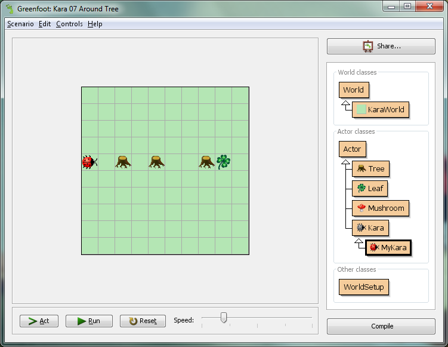

+++
title = "GreenfootKara"
date = 2012-10-03
updated = 2014-03-08
image = "greenfootkara-screenshot.png"
description = "GreenfootKara ist eine visuelle und interaktive Einführung in die Programmierung in Java basierdend auf der Greenfoot IDE."
prettify = false
comments = true
commentsIdentifier = "/library/greenfoot-kara/de/"
aliases = [ 
  "/library/greenfoot-kara/de/" 
]

sidebarName = "Einleitung"
pagingName = "Intro"

[[sidebars]]
header = "Downloads"
[[sidebars.items]]
text = "<i class=\"fa fa-fw fa-file-word-o\"></i> Seite als Word-Datei"
link = "/de/library/convert-web-page-to-word/"
+++

> `GreenfootKara` ist eine visuelle und interaktive Einführung in die Programmierung. Es basiert auf der [Greenfoot IDE](https://www.greenfoot.org) und kombiniert das bewährte Konzept von [Kara](http://www.swisseduc.ch/informatik/karatojava/) mit der Flexibilität und Bedienerfreundlichkeit von Greenfoot.

**Hinweis:** Wenn Sie anstatt mit Greenfoot lieber mit einer IDE wie **Eclipse oder NetBeans** arbeiten möchten, lesen Sie die Einführung zu [GameGridKara](/de/library/gamegrid-kara/).

## Greenfoot

[Greenfoot](https://www.greenfoot.org) ist eine einfache Entwicklungsumgebung für Java. Sie ermöglicht eine sehr schnelle Entwicklung von interaktiven, grafischen Projekten.

Wenn Sie eine Lehrperson sind, können Sie für Greenfoot Szenarien beliebiger Schwierigkeitsstufen erstellen, welche von den Lernenden weiterbearbeitet werden können. `GreenfootKara` beinhaltet eine ganze Reihe solcher Szenarien mit dem Kara-Käfer.

Programmieranfänger können durch Greenfoot von Schwierigkeiten beim Einstieg in die Programmierung abgeschirmt werden (z.B. `public static void main(String [])` und co.). Trotzdem sind in Greenfoot nach oben alle Möglichkeiten offen. So können Fortgeschrittene damit auch sehr komplexe Projekte realisieren.

## Kara

Kara ist ein Käfer, der in einer einfachen Welt aus Bäumen, Blättern und Pilzen lebt.

   

Die Möglichkeiten von Kara sind wie folgt:

### Karas Aktionen

* Kara macht einen Schritt vorwärts mit `move()` (Kara kann Pilze schieben, auf Kleeblätter treten aber er kann nicht durch Bäume hindurch gehen)
* Kara dreht sich um 90° nach mit `turnLeft()` oder `turnRight()`
* Kara legt ein Kleeblatt mit `putLeaf()`
* Kara entfernt ein Kleeblatt mit `removeLeaf()`

### Karas Sensoren

* Kara schaut nach, ob er sich auf einem Kleeblatt befindet mit `onLeaf()`
* Kara schaut nach, ob er sich vor oder neben einem Baum befindet mit `treeFront()`, `treeLeft()` oder `treeRight()`
* Kara schaut nach, ob er einen Pilz vor sich hat mit `mushroomFront()`

***

## Los geht's

Laden Sie [Greenfoot](https://www.greenfoot.org/download) herunter und installieren Sie es. Nach der Installation sollte es möglich sein die vorgefertigten Kara Szenarien zu öffnen (siehe Downloads auf den nachfolgenden Seiten).

Um gleich loszulegen, gehen Sie zu [Kapitel 1: Erste Schritte](/de/library/greenfoot-kara/chapter1/).

Um mehr Hintergrundinformationen zu erhalten über `GreenfootKara` lesen Sie die [Hintergrundinfos](/de/library/greenfoot-kara/background/).

