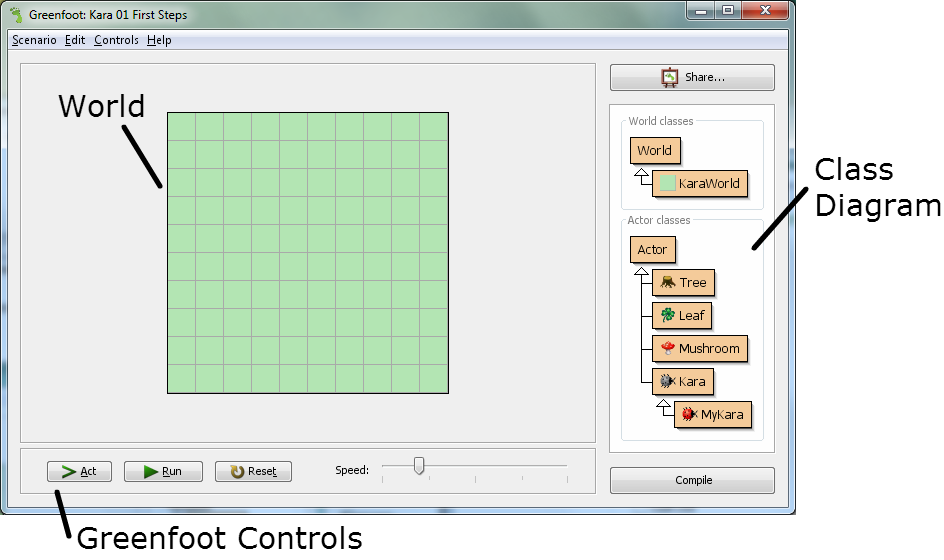
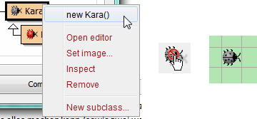
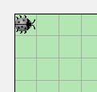
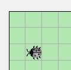
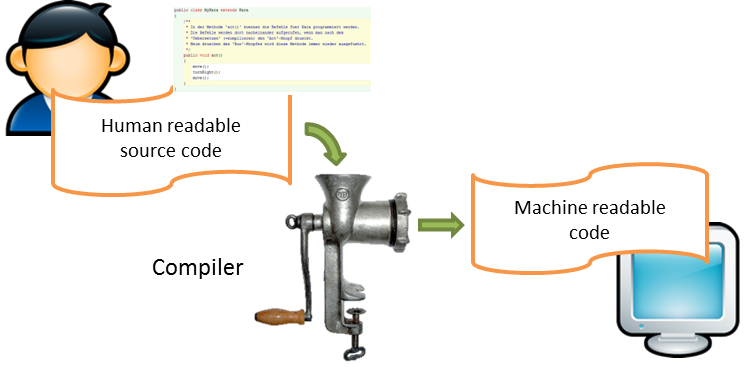
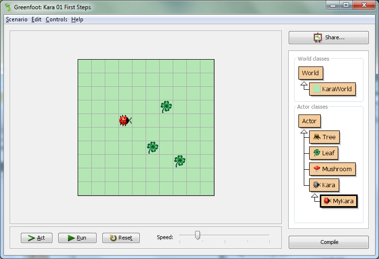

+++
title = "Chapitre 1: Premiers Pas"
date = 2014-07-10
image = "greenfootkara-screenshot.png"
description = "Dans ce chapitre de GreenfootKara, nous allons faire nos premiers pas dans la programmation."
prettify = true
comments = true
commentsIdentifier = "/library/greenfoot-kara/fr/chapter1/"
aliases = [ 
  "/library/greenfoot-kara/fr/chapter1/" 
]

pagingName = "1"
weight = 2

[[sidebars]]
header = "Solutions"
[[sidebars.items]]
text = "<i class=\"fa fa-fw fa-check-square-o\"></i> Solutions Chapitre 1"
link = "/fr/library/greenfoot-kara/chapter1/solutions/"

[[sidebars]]
header = "Downloads"
[[sidebars.items]]
text = "<i class=\"fa fa-fw fa-file-archive-o\"></i> scenarios-chapter-1.zip"
link = "https://github.com/marcojakob/greenfoot-kara/releases/download/v2.1.1/scenarios-chapter-1.zip"
[[sidebars.items]]
text = "<i class=\"fa fa-fw fa-file-word-o\"></i> Page en fichier Word"
link = "/library/convert-web-page-to-word/"
+++

## Démarrer Greenfoot

Ouvrez votre installation de [Greenfoot](https://www.greenfoot.org).

(Si vous ouvrez Greenfoot pour la première fois, une boite de dialogue demande de que vous voulez. Cliquez sur *choose scenario*.)

Ouvrez le scénario `Kara 101 First Steps` dans le dossier `scenarios-chapter-1`.
S'affiche alors la fenêtre principale de Greenfoot telle que ci-dessous:

La fenêtre Greenfoot consiste en trois espaces et quelques boutons. Les trois espaces sont :

* Le **world** (monde) : l'espace le plus important est appelé world. C'est l'espace d'exécution des programmes, où nous pouvons voir ce qui se passe. Pour les scénarios Kara c'est un pré, vert avec des lignes d'une grille.
* Le **diagramme de classes** : cet espace permet de voir les classes disponibles. Premièrement, nous aurons principalement besoin de l'insecte Kara.
* Les **contrôle Greenfoot** : les boutons Act, Run, and Reset et le réglage de la vitesse d'exécution en bas servent à contrôler le programme. On reviendra sur cela plus tard.

***

## Classes et Objects

Pour nos projets nous utilisons le langage de programmation **Java**. Java est un langage orienté objet. Dans la programmaiton orientée objet, les concepts de classes et d'objects revêtent une importance primordiale.

Examinons la **classe** de `Kara`. `Kara` est une classe dans le sens où elle représente le concept général d'insecte de type coccinelle, c'est comme un moule avec lequel on pourrait produire autant d'insectes que voulu. Les "vrais" insectes issus du moule sont appelés des **objects** (ou des instances).

Dans Greenfoot, nous créons de nouveaux objets ainsi : *clic droit* sur la classe Kara | item *new Kara()*. Et on place l'objet crée à l'endroit voulu sur le monde.

#### <i class="fa fa-rocket"></i> TÂCHE 1.01

Créez un objet à partir de Kara (la classe en **gris**). Créez plusieurs objets feuille.

*Astuce : Pour créer plusieurs objets de la même classe, appuyez surla touche Shift avant de cliquer.*

***

## Interagir avec les Objets

Pour interagir avec les objets sur le monde, on clique droi t sur l'objet afin de faire apparaître le minu contextuel. Le **menu de l'objet** issu de Kara montre ce que Kara peut faire. Ces opérations sont appelées des **méthodes** en Java.

#### <i class="fa fa-rocket"></i> TÂCHE 1.02

1. Que fait la méthode `move()` ?
2. Placez deux Karas et faites les se faire face. De quelle méthode avez-vous besoin ?
3. Essayez les autres méthodes. Il existe deux types de méthodes. Quelles sont ces 2 types et que font-elles ?

***

## Types de retour

Le mot placé devant le nom de la méthode s'appelle le **type de retour**. Il nous indique quel type d'information la méthode nous retourne quand on l'invoque. Le mot `void` dans ce cas signifie "rien" – Ces méthodes ne retournent aucune information, elles font seulement les actions pour lesquelles elles ont été programmées.

Si, à la place de `void` il y a un autre mot, nous savons que notre méthode retourne un résultat et de quel type. Le type `boolean` (booléen) prend une seule des deux valeurs possibles `true` or `false`. Il existe d'autres types de retour que l'on verra plus tard.

#### <i class="fa fa-rocket"></i> TÂCHE 1.03

1. Clic droit sur l'objet Kara et appelez la méthode `onLeaf()`. Est-ce qu'elle retourne toujours `false` ? Ou y a-t-il des cas où elle retourne `true` ?   
2. Ajoutez un arbre au monde. Quelle méthode invoquer pour vérifier si Kara est face à un arbre ?   
3. Que se passe-t-il si vous invoyez la méthode `move()` de Kara method alors qu'elle fait face à un arbre ?   

***

## État de l'object

Si nous *cliquons droit* sur un objet Kara, et que nous selectionnons *inspect*, nous pouvon examiner l'état de l'objet.

#### <i class="fa fa-rocket"></i> TÂCHE 1.04

Quelles sont les valeurs des coordonnées et de la rotation dans les situations suivantes ?

1. x: ?, y: ?, rotation: ?   

2. x: ?, y: ?, rotation: ?   

**Note: La première cellule en haut à gauche a les coordonnées  (0, 0)  et non pas (1, 1) !**

***

## Exécuter des Programmes dans Greenfoot

Jusqu'à maintenant nous avons interagi avec les objets en utilisant des clics de souris. Mais il y a une autre possiblité : en écrivant des programmes.

À partir de maintenant on va travailler avec la classe `MyKara` (**red Kara**) !

C'est dans cette classe que nous écrirons nos programmes.

#### <i class="fa fa-rocket"></i> TÂCHE 1.05

1. Placez un objet `MyKara` dans le monde. Quelle nouvelle méthode est  devenue disponible ?   
2. Que fait cette méthode ?   
3. Que se passe-t-il si vous appuyez sur le bouton de contrôle Act de Greenfoot ?   
4. Appuyez sur le **bouton Run**. Que se passe-t-il ? Essayez d'utiliser le potentiomètre linéaire.   
act() est appelée encore et encore jusqu'à ce le bouton pause soit cliqué.
5. Quelle méthodes peut-on voir quand on clique droit sur `MyKara` puis "inherited from Kara" ? Peut-on utiliser ces méthodes ?   

***

## Code Source

Nous avons utilisé la méthode `act()`. Regardons maintenant comment les comportements qu'elle réalise sont programmés. Pour cela nous devons ouvrir le **code source** dans l'éditeur : *Clic droit* sur la classe `MyKara` et choisir *Open editor* (ou faites juste un *double clic*).

Le code source est écrit en **Java** et contient tous les détails à propos de la  classe et ses objets. Pour le  mo-ment ce qui nous intéresse est ce qui est sous la méthode `act()`. Ici,  les 3 commandes : `move()`, `turnRight()` and `move()` sont appelées. On peut ici modifier et étendre ces commandes.

Quand on a terminé nos modifications, fermons la fenêtre de l'éditeur. Vous remarquerez que la classe est maintenant représentée rayée de gris. 

Ceci est l'indication que la classe a été moifiée et qu'elle doit être **compilée**. La compilation est un processus de traduction : le code source de la classe est traduit du langage que nous comprenons en langage machine qui pourra être compris par l'ordinateur.

Les classes dans Greenfoot sont traduites en utilisant le bouton **Compile** (en bas à droite de la fenêtre princi-pale). Une fois les classes compilées, les rayures disparaissent et on peut de nouveau créer des objets.

### La compilation (processus de traduction)

#### <i class="fa fa-rocket"></i> TÂCHE 1.06

Modifiez le contenu de la méthode `act()` afin que Kara fasse d'abord un pas, puis dépose une feuille par terre et fasse de nouveau un pas. (En début de classe vous trouverez un commentaire qui décrit toutes les actions que Kara peut réaliser.)

*Note: Il faut terminer chaque action par un point-virgule !*

#### <i class="fa fa-rocket"></i> TÂCHE 1.07

Créez le monde tel que présenté ci-contre :

**Astuce :** Afin de ne pas avoir à recréer le monde après chaque compilationvous pouvez sauvegarder le monde en cliquant droit sur le World et en invoquant saveWorldSetupToFile(). Puis choisissez un nom de fichier. Pour pouvoir charger le monde sauvegardé il faut modifier la valeur de la constante `WORLD_SETUP_FILE` dans `KaraWorld`:

<pre class="prettyprint lang-java">
public static final String WORLD_SETUP_FILE = "[MyName].txt";
</pre>

Ecrivez un programme qui amène Kara jusqu'à la feuille en suivant le chemin de points sur l'image ci-dessus. Elle devra contourner les arbres. Arrivée à la feuille elle la prend.

***

## Kara bénéficie de nouvelles méthodes

#### <i class="fa fa-rocket"></i> TÂCHE 1.08

Si vous avez résolu la tâche 1.07 correctement, your programme devrait contenir *trois parties égales**, et ce afin de pouvoir contourner les 3 arbres. On pourrait améliorer notre programme en ajoutant une nouvelle méthode. En-dessous la méthode `act()` nous créons une nouvelle méthode :

<pre class="prettyprint lang-java">
public void goAroundTree() {

}
</pre>

Entre les accolades, écrivez les commandes nécessaires pour contourner un arbre.

Maintenant invoquez la nouvelle méthode `goAroundTree()` à l'intérieur de la méthode `act()` pour chacun des trois arbres.

***

## Synthèse du Chapitre 1

1. Rapprochez les noms ci-dessous aux éléments de la capture d'écran :   
*World, Diagramme de Classe, bouton compile, une classe, un objet*   

2. Qui a-t-il de spécial avec une méthode don't le type de retour est `void`  ?   
*Elle réalise l'action (les actions) mais ne retourne rien.*

3. Qui a-t-il de spécial avec une méthode don't le type de retour est `boolean` ?   
*La méthode retourne un résultat de type booléen.*

4. Combien de valeurs différentes un booléen peut-il ?   
*true et false*

5. Quelle différence y a-t-il entre `move()` et `act()` dans notre scénario  Kara ?   
*move() déplace Kara d'un pas en avant. Dans act() nous pouvons appeler toutes les méthodes que l'on veut.*

6. Qu'est-ce que la compilation ? Pourquoi est-ce nécessaire ?   
*La compilation est l'opération qui traduit le langage de programmation que nous comprenons dans des in-structions machine que l'ordinateur comprend et exécute.*

***

## Etape suivante ?

&rarr; [Chapitre 2: Ordinogramme](/fr/library/greenfoot-kara/chapter2/)

*** 

***Sources:*** *Le travail de se chapitre s'appuie sur l'ouvrage [Introduction to Programming with Greenfoot](https://www.greenfoot.org/book) par Michael Kölling (2010).
Les [idées et concepts de Kara](http://www.swisseduc.ch/informatik/karatojava/) ont été developpés par Jürg Nievergelt, Werner Hartmann, Raimond Reichert et al.*

***Traduction française:*** *Christian Malen <i class="fa fa-trophy"></i> - thank you for your contributions!* 

