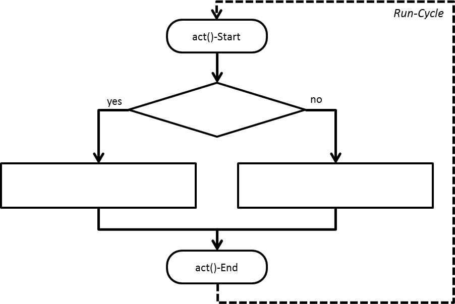
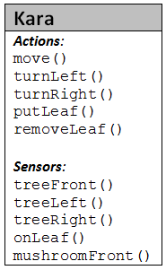
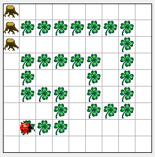
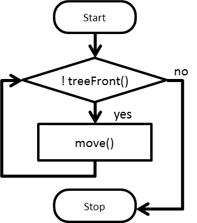
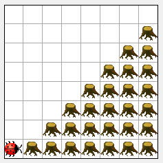
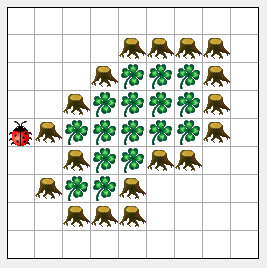

+++
title = "Chapitre 2: Ordinogramme"
date = 2014-07-10
image = "greenfootkara-screenshot.png"
description = "Pour résoudre des problèmes difficiles en programmation, il est souvent utile de représenter graphiquement la succession de tâches à l'aide d'un diagramme simple."
prettify = true
comments = true
commentsIdentifier = "/library/greenfoot-kara/fr/chapter2/"
aliases = [ 
  "/library/greenfoot-kara/fr/chapter2/" 
]

pagingName = "2"
weight = 3

[[sidebars]]
header = "Solutions"
[[sidebars.items]]
text = "<i class=\"fa fa-fw fa-check-square-o\"></i> Solutions Chapitre 2"
link = "/fr/library/greenfoot-kara/chapter2/solutions/"

[[sidebars]]
header = "Downloads"
[[sidebars.items]]
text = "<i class=\"fa fa-fw fa-file-archive-o\"></i> scenarios-chapter-2.zip"
link = "https://github.com/marcojakob/greenfoot-kara/releases/download/v2.1.1/scenarios-chapter-2.zip"
[[sidebars.items]]
text = "<i class=\"fa fa-fw fa-file-word-o\"></i> Page en fichier Word"
link = "/library/convert-web-page-to-word/"
+++

## Le diagramme

Pour résoudre des problèmes difficiles en programmation, il est souvent utile de représenter graphiquement la succession de tâches à l'aide d'un diagramme simple. On utilise pour cela les symboles suivants :

<table class="table table-bordered text-center">
  <tbody>
    <tr>
      <td></td>
      <td>Départ / Arrêt</td>
    </tr>
    <tr>
      <td></td>
      <td>Action</td>
    </tr>
    <tr>
      <td></td>
      <td>Décision / Condition</td>
    </tr>
  </tbody>
</table>

#### <i class="fa fa-rocket"></i> TÂCHE 2.01

Complétez le diagramme afin que Kara atteigne la feuille en respectant les consignes suivantes :

* La feuille est toujours droit devant elle – elle a seulement besoin de contourner les arbres.
* On ne trouve jamais deux arbres côte à côte.

 

#### <i class="fa fa-rocket"></i> TÂCHE 2.02

Dessinez un diagramme détaillé où Kara prend la feuille à la fin si elle la trouve. Dans le cartouche vous trouverez les méthodes disponibles de Kara :

***

## Les instructions conditionnelles en Java

<pre class="prettyprint lang-java">
if (treeFront()) {      // Condition (Vrai/Faux).
	turnLeft();         // Bloc 1, exécuté si la con-dition est true.
} else {
	move();             // Bloc 2, exécuté si la con-dition est false.
}
</pre>

**Note: Le mot clé else et son bloc (block 2) peuvent être omis si non nécessaires.**

#### <i class="fa fa-rocket"></i> TÂCHE 2.03

1. Décrivez avec des mots ce que réalise le code suivant. 
2. Puis décrivez chacune d'entre elles dans un diagramme.

<pre class="prettyprint lang-java">
if (onLeaf()) {
	removeLeaf();
} else {
	putLeaf();
}
move();
</pre>

#### <i class="fa fa-rocket"></i> TÂCHE 2.04

1. Décrivez avec des mots ce que réalise le code suivant. 
2. Puis décrivez chacune d'entre elles dans un diagramme.

<pre class="prettyprint lang-java">
if (onLeaf()) {
	move();
}
</pre>

#### <i class="fa fa-rocket"></i> TÂCHE 2.05

Les conditions peuvent être imbriquées.

1. Décrivez avec des mots ce que réalise le code suivant. 
2. Puis décrivez chacune d'entre elles dans un diagramme.

<pre class="prettyprint lang-java">
if (treeLeft()) {
	if (onLeaf()) {
		removeLeaf();
		move();
	} else {
		move();
	}
} else {
	move();
}
</pre>

### Implémentation

#### <i class="fa fa-rocket"></i> TÂCHE 2.06 : Autour de l'arbre II

* Ouvrez le scénario **Kara 206...** à partir du dossier **scenarios-chapter-2**. Dans ce scénario, la méthode `goAroundTree()` est déjà programée et invoquée dans la méthode `act()`.
* Maintenant programmez dans la méthode `act()` ce que vous avez dessiné à la  *tâche 2* comme diagramme. 
* Dans ce scénario, il y a **plusieurs Mondes** (a, b et c).
* Votre programme devrait marcher quelque soit le monde (a,b ou c) **sans message d'erreur**.

#### <i class="fa fa-rocket"></i> TÂCHE 2.07 : Conditions imbriquées

* Ouvrez le scénario **Kara 207...**; écrivez le programme tel qu'il apparaît dans la *tâche 5*.
* Modifiez le programme pour que Kara prenne une feuille seulement s'il n'y a pas d'arbre à côté.

***

## Opérations logiques

Notre Kara peut déjà réaliser des actions un peu complexes. Nous allons la faire réagir différemment suivant le résultat d'un test. Il sera aussi possible pour Kara de réagir simultanément en fonction de plusieurs conditions dans un même test.

Le tableau suivant montre les trois opérateurs logiques principaux en Java :

<table class="table">
  <thead>
    <tr>
      <th>Opérator</th>
      <th>Description</th>
      <th>Exemple</th>
      <th></th>
    </tr>
  </thead>
  <tbody>
    <tr>
      <td>`&&`</td>
      <td>et</td>
      <td>`treeFront() && onLeaf()`</td>
      <td>VRAI (true) seulement si les deux conditions sont vraies, ç.à d. si Kara fait face à un arbre **et** est sur une feuille.</td>
    </tr>
    <tr>
      <td>`||`</td>
      <td>ou</td>
      <td>`treeFront() || onLeaf()`</td>
      <td>VRAI (true) si l'un **ou** l'autre **ou** les deux ex-pressions sont vraies.</td>
    </tr>
    <tr>
      <td>`!`</td>
      <td>non</td>
      <td>`!treeFront()`</td>
      <td>Fait passer une expression de true à false et vice versa. Cette expression sera VRAI (true) si Kara **ne** fait **pas** not face à un arbre.</td>
    </tr>
  </tbody>
</table>

Un exemple en Java pourrait ressembler à cela :

<pre class="prettyprint lang-java">
if (treeLeft() && onLeaf()) {
	// Do something ...
}
</pre>

or combined:

<pre class="prettyprint lang-java">
if (treeLeft() && !treeRight()) {
	// Do something ...
}
</pre>

#### <i class="fa fa-rocket"></i> TÂCHE 2.08 : Peur du tunnel

Kara a un peu peur des tunnels. Elle devra vérifier à chaque pas si ce n'est pas une entrée de tunnel (c. à d. s'il y des arbres de chaque côté). Si c'est le cas,  elle laisse immédiatement tomber une feuille à cause du stress.

Charger le scénario **Kara 208...**, écrivez le programme et testez le avec les 3 mondes.

#### <i class="fa fa-rocket"></i> TÂCHE 2.09 : Feuille sur l'arbre

Maintenant laissez Kara se déplacer en ligne et laisser une feuille devant chaque arbre (qu'il n'y en ait qu'un ou un de chaque côté).

Charger le scénario **Kara 209...**, écrivez le programme.

#### <i class="fa fa-rocket"></i> TÂCHE 2.10 : Réaliser une ligne de feuilles

Kara va tout droit et dépose une feuille à chaque fois qu'il n'y en a pas. Quand elle arrive à l'arbre elle s'arrête (même si on appuie sur le bouton Excécuter).

Charger le scénario **Kara 210...**, écrivez le programme.

#### <i class="fa fa-rocket"></i> TÂCHE 2.11 : Round Trip

Kara commence à avancer vers la droite, elle fait le tour sans heurter d'arbre  et finit par manger la feuille. 

Charger le scénario **Kara 211...**, écrivez le programme. Testez votre programme avec les 3 mondes.

*Astuce : Imaginez ce qui doit être réalisé à chaque fois qu'on appuie sur le bouton Act. Pour vous aider dessinez un diagramme.*

#### <i class="fa fa-rocket"></i> TÂCHE 2.12 (difficile) : Kara joue à Pacman

Kara joue à Pacman : Elle se tient sur la première d'une longue suite de feuilles qui se termine devant un arbre. Elle récupère toutes les feuilles et s'arrête devant les arbres.

Pour un meilleur style d'écriture du code, écrivez les méthodes séparément de la méthode act et invoquez ces méthodes dans la méthode act.

***

## Boucles

Kara peut maintenant réagir aux situations en fonction de règles que nous avons définies. Elle n'est pas encore capable de repéter un ensemble déterminé d'instructions. Pour exécuter une instruction plusieurs fois on utilise les boucles.

Comme exemple, on souhaite : 

*Kara avance jusqu'à ce qu'elle rencontre un arbre.*

Dans le diagramme on peut voir que `move()` est utilisée plusieurs fois, en fait tant qu'un arbre ne barre pas la route à Kara.

Notation utilisée en Java :

<pre class="prettyprint lang-java">
while (!treeFront()) {
	move();
}
</pre>

#### <i class="fa fa-rocket"></i> TÂCHE 2.13

Dans la situation suivante : Kara est devant un tunnel.

Descrivez ce que chacune des boucles suivantes fait, et combien de pas fait Kara.

<table class="table">
  <thead>
    <tr>
      <th>#</th>
      <th>Code</th>
      <th>Explication</th>
      <th>Nbre de pas</th>
    </tr>
  </thead>
  <tbody>
    <tr>
      <td>a.</td>
      <td><pre>while (treeLeft()) {
  move();
}</pre></td>
      <td>Se déplace tant qu'il y a un arbre sur sa gauche.</td>
      <td>4</td>
    </tr>
    
    <tr>
      <td>b.</td>
      <td><pre>while (treeRight()) {
  move();
}</pre></td>
      <td>?</td>
      <td>?</td>
    </tr>
    
    <tr>
      <td>c.</td>
      <td><pre>while (treeLeft() || treeRight()) {
  move();
}</pre></td>
      <td>?</td>
      <td>?</td>
    </tr>
    
    <tr>
      <td>d.</td>
      <td><pre>if (treeLeft()) {
  move();
} while (treeLeft() && treeRight()) {
  move();
}</pre></td>
      <td>?</td>
      <td>?</td>
    </tr>

    <tr>
      <td>e.</td>
      <td><pre>while (!treeFront) {
  if (treeLeft()) {
    move();
  }
}</pre></td>
      <td>?</td>
      <td>?</td>
    </tr>
    
  </tbody>
</table>

#### <i class="fa fa-rocket"></i> TÂCHE 2.14 : Autour de l'arbre III

L' exercise est similaire à celui de la tâche 9 : Kara doit trouver une feuille qui est devant elle. Mais ici, il peut y avoir un nombre quelconque d'arbres sur la ligne.

* Chargez le scénario **Kara 214...** et améliorez la méthode `goAroundTree()`afin que Kara puisse con-tourner plusieurs arbres. Testez votre programme dans tous les mondes disponibles.
* Modifiez `act()` de manière à ce qu'il y ait besoin d'appuyer sur le bouton act une seule fois. Kara devra alors contourner les arbres et avancer jusqu'à parvenir à la feuille. Arrivée à la feuille elle la mange.

#### <i class="fa fa-rocket"></i> TÂCHE 2.15 : Grimper

Kara devra monter des escaliers...

Ecrivez une méthode `oneStepUp()` afin que Kara monte une seule marche. Vous devrez vous représenter comment Kara saura qu'elle a encore une marche à gravir ou si elle a atteint le haut de l'escalier.

*Note : La solution devra marcher en appuyant une seule fois sur le bouton act.*

#### <i class="fa fa-rocket"></i> TÂCHE 2.16 (difficile) : Kara garde forestier

Kara doit garder la forêt. Elle doit marcher sans fin tout au tour de la forêt. Pour vous aider, vous pouvez dessiner un diagramme.

*Note: Pour obtenir une boucle infinie, on peut appuyer sur le bouton Run.*

***

## Etape suivante ?

&rarr; [Chapitre 3: Variables](/library/greenfoot-kara/fr/chapter3/)

*** 

***Sources:*** *Les [idées et concepts de Kara](http://www.swisseduc.ch/informatik/karatojava/) ont été developpés par Jürg Nievergelt, Werner Hartmann, Raimond Reichert et al. Quelques exercices Kara s'appuient sur le [travail de Horst Gierhardt](http://www.swisseduc.ch/informatik/karatojava/javakara/material/).*

***Traduction française:*** *Christian Malen <i class="fa fa-trophy"></i> - thank you for your contributions!* 

