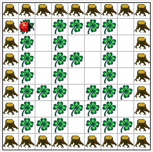
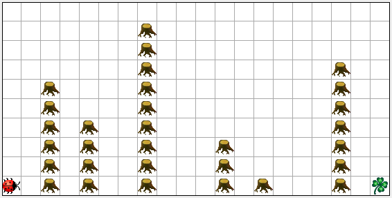

+++
title = "Kapitel 3: Variablen"
date = 2012-10-03
updated = 2014-03-08
image = "greenfootkara-screenshot.png"
description = "In diesem Kapitel von GreenfootKara lernend wir über Variablen."
prettify = true
comments = true
commentsIdentifier = "/library/greenfoot-kara/de/chapter3/"
aliases = [ 
  "/library/greenfoot-kara/de/chapter3/" 
]

pagingName = "3"
weight = 4

[[sidebars]]
header = "Lösungen"
[[sidebars.items]]
text = "<i class=\"fa fa-fw fa-check-square-o\"></i> Lösungen Kapitel 3"
link = "/de/library/greenfoot-kara/chapter3/solutions/"

[[sidebars]]
header = "Downloads"
[[sidebars.items]]
text = "<i class=\"fa fa-fw fa-file-archive-o\"></i> scenarios-chapter-3.zip"
link = "https://github.com/marcojakob/greenfoot-kara/releases/download/v2.1.1/scenarios-chapter-3.zip"
[[sidebars.items]]
text = "<i class=\"fa fa-fw fa-file-word-o\"></i> Seite als Word-Datei"
link = "/de/library/convert-web-page-to-word/"
+++

Im letzten Kapitel haben wir gelernt, bestimmte Ereignisse zu wiederholen solange eine Bedingung erfüllt ist. Nun möchten wir aber folgendes tun:

*Kara soll eine Spur von fünf Kleeblättern legen.*

 

Dies wäre natürlich recht einfach, wenn wir einfach `putLeaf()` und `move()` fünfmal aufrufen, jedoch wenig elegant. Schöner wäre es, wenn Kara mitzählt, wie viele Blätter er bereits abgelegt hat. Damit Kara zählen kann, braucht er ein "Gedächtnis", d.h. konkret einen Speicher. Die Speicherplätze beim Programmieren sind durch Variablen ansprechbar.

### Zählen mit Kara

<pre class="prettyprint lang-java">
int i;
i = 0;

while (i &lt; 5) {
	putLeaf();
	move();

	i = i + 1;
}
</pre>

#### Erklärungen

1. Mit `int i;` wird Speicherplatz für eine Variable mit dem Namen `i` und dem Typ `int`, d.h. "integer", reserviert. Man sagt: Die **Variable i wird deklariert**. In Java gibt es unterschiedliche Typen, die verwendet werden können (siehe nachfolgende Tabellen).
2. Durch `i = 0;` wird der Variable `i` der Wert `0` zugewiesen. Da es die erste Wertzuweisung für die Variable ist, sagt man auch: Die **Variable i wird initialisiert**.
3. Deklaration und Initialisierung werden meistens zusammengefasst wie folgt:
`int i = 0;`
4. Für die Bedingung `i < 5` wird der Vergleichsoperator `<` benutzt (weitere Vergleichsoperatoren siehe nachfolgende Tabellen).
5. Bei der Zuweisung `i = i + 1;` muss man zuerst den rechten Teil anschauen. Es bedeutet: "Nimm den aktuellen Wert von i, addiere 1 dazu und speichere den neuen Wert wieder unter dem Namen i ab."

#### Weitere Hinweise zu Variablen

* Es ist möglich, eine Variable mit einem endgültigen, unveränderlichen Wert zu versehen, d.h. sie zu einer Konstanten zu machen:   
`final int ANZAHL = 5;`   
Dann könnte man im obigen Programmbeispiel `while (i < ANZAHL)` schreiben.   
Konstanten schreibt man komplett mit Grossbuchstaben.
* Variablen schreibt man wie Methoden beginnend mit einem Kleinbuchstaben!

***

## Elementare Datentypen in Java

Diese Datentypen heissen "elementar", da es die Grunddatentypen in Java sind. (Später werden wir lernen, wie man Variablentypen für ganze Objekte erstellen kann).

### Ganze Zahlen und Zeichen

<table class="table table-bordered">
  <thead>
    <tr>
      <th>Typ</th>
      <th>von</th>
      <th>bis einschliesslich</th>
      <th>Speicherbedarf</th>
    </tr>
  </thead>
  <tbody>
    <tr>
      <td>`byte`</td>
      <td>-128</td>
      <td>127</td>
      <td>8 bit</td>
    </tr>
    <tr>
      <td>`short`</td>
      <td>-32'768</td>
      <td>32'767</td>
      <td>16 bit</td>
    </tr>
    <tr>
      <td>`int`</td>
      <td>-2'147'483'648</td>
      <td>2'147'483'647</td>
      <td>32 bit</td>
    </tr>
    <tr>
      <td>`long`</td>
      <td>-9'223'372'036'854'775'808</td>
      <td>9'223'372'036'854'775'807</td>
      <td>64 bit</td>
    </tr>
    <tr>
      <td>`char`</td>
      <td>0</td>
      <td>65'635</td>
      <td>16 bit</td>
    </tr>
  </tbody>
</table>

### Fliesskomma-Zahlen

<table class="table table-bordered">
  <thead>
    <tr>
      <th>Typ</th>
      <th>von</th>
      <th>bis einschliesslich</th>
      <th>Speicherbedarf</th>
    </tr>
  </thead>
  <tbody>
    <tr>
      <td>`float`</td>
      <td>-3.4 \* 1038</td>
      <td>3.4 \* 1038</td>
      <td>32 bit</td>
    </tr>
    <tr>
      <td>`double`</td>
      <td>-1.7 \* 10308</td>
      <td>1.7 \* 10308</td>
      <td>64 bit</td>
    </tr>
  </tbody>
</table>

### Wahrheitswerte

<table class="table table-bordered">
  <thead>
    <tr>
      <th>Typ</th>
      <th>Wertebereich</th>
      <th>Speicherbedarf</th>
    </tr>
  </thead>
  <tbody>
    <tr>
      <td>`boolean`</td>
      <td>`true` oder `false`</td>
      <td>1 bit</td>
    </tr>
  </tbody>
</table>

***

## Vergleichsoperatoren

Folgende Operatoren können in Java für Vergleiche verwendet werden. Das Ergebnis ist jeweils ein boolean (entweder `true` oder `false`).

<table class="table table-bordered">
  <thead>
    <tr>
      <th>Operator</th>
      <th>Bedeutung</th>
      <th>Beispiel</th>
    </tr>
  </thead>
  <tbody>
    <tr>
      <td>`==`</td>
      <td>gleich</td>
      <td>`k == 2`</td>
    </tr>
    <tr>
      <td>`!=`</td>
      <td>ungleich</td>
      <td>`k < 12`</td>
    </tr>
    <tr>
      <td>`>`</td>
      <td>grösser als</td>
      <td>`k > 67`</td>
    </tr>
    <tr>
      <td>`<`</td>
      <td>kleiner als</td>
      <td>`k < 12`</td>
    </tr>
    <tr>
      <td>`>=`</td>
      <td>grösser als oder gleich</td>
      <td>`k >= 45`</td>
    </tr>
    <tr>
      <td>`<=`</td>
      <td>kleiner als oder gleich</td>
      <td>`k <= 23`</td>
    </tr>
  </tbody>
</table>

**Achtung:** Der Vergleich auf "Gleichheit" hat immer zwei Gleichheitszeichen `==`. Mit einem einzelnen Gleichheitszeichen `=` geschieht eine Zuweisung!

***

## Arithmetische Operatoren

Zur Berechnung können folgende arithmetische Operatoren verwendet werden:

<table class="table table-bordered">
  <thead>
    <tr>
      <th>Operator</th>
      <th>Bedeutung</th>
      <th>Beispiel</th>
    </tr>
  </thead>
  <tbody>
    <tr>
      <td>`+`</td>
      <td>Addition</td>
      <td>`h = w + 34`</td>
    </tr>
    <tr>
      <td>`-`</td>
      <td>Subtraktion</td>
      <td>`y = 3.4 – t`</td>
    </tr>
    <tr>
      <td>`*`</td>
      <td>Multiplikation</td>
      <td>`z = h * 3.56`</td>
    </tr>
    <tr>
      <td>`/`</td>
      <td>Division</td>
      <td>`d = m / v`</td>
    </tr>
    <tr>
      <td>`%`</td>
      <td>Modulo (liefert den Rest der Division)</td>
      <td>`count = w % 2`</td>
    </tr>
  </tbody>
</table>

***

#### <i class="fa fa-rocket"></i> TASK 3.01: Kara zählt Kleeblätter

 

Kara soll waagrecht von links nach rechts gehen bis zum Baum und dabei die Kleeblätter zählen.

*Hinweise:*

* Am Schluss können Sie das Resultat mit dem folgenden Befehl auf die "Konsole" schreiben: `System.out.println("Das Resultat ist: " + count);`
* Text muss man in Anführungszeichen schreiben. Das Pluszeichen bewirkt, dass die variable `count` hinten angefügt wird.
* *Gültigkeitsbereich von Variablen*: Variablen sind immer nur innerhalb des Blockes (zwischen den geschweiften Klammern) gültig, in welchem sie deklariert wurden. Man kann sie auch ausserhalb der Methoden deklarieren, dann gelten sie für die ganze Klasse. 

#### <i class="fa fa-rocket"></i> TASK 3.02: Kara in a Box I

 

Eine quadratische Fläche ist von Bäumen umrandet. Innerhalb der Fläche ist ein Muster aus Kleeblättern gelegt, das von Kara invertiert (= umgedreht) werden soll. Kara startet links oben in der Ecke mit Blick nach rechts.

*Hinweise:*

* Bei dieser Aufgabe ist es hilfreich, mit booleschen Variablen zu arbeiten, z.B.:
  * Deklaration und Initilalisierung: `boolean goingRight = false;`
  * Aus true wird false und umgekehrt: `goingRight = !goingRight;`
  * Boolesche Variable als Bedingung: `if (goingRight)`

#### <i class="fa fa-rocket"></i> TASK 3.03: Kara in a Box II

 

Eine quadratische Fläche ist von Bäumen umrandet. Innerhalb der Fläche soll ein schachbrettartiges Muster aus Kleeblättern von Kara gelegt werden. Kara startet links oben in der Ecke mit Blick nach rechts.

#### <i class="fa fa-rocket"></i> TASK 3.04 (schwierig): Die längste Baumreihe

 

Auf der Wiese hat es verschiedene Baumreihen. Kara soll nun die Länge (in Anzahl Bäumen) der längsten Baumreihe ermitteln und auf die Konsole ausgeben. Zwischen d en Baumreihen ist immer mindestens ein Feld Platz. Auf dem letzten Feld liegt ein Kleeblatt.

#### <i class="fa fa-rocket"></i> TASK 3.05 (sehr schwierig): Push Mushroom Through Tunnel

 

Die Welt von Kara hat zwei Boxen, welche durch einen Tunnel verbunden sind. In der Box links befindet sich Kara und ein Kleeblatt. In der Box rechts befindet sich ein Pilz. Kara soll nun auf die andere Seite gelangen, den Pilz finden und ihn auf die andere Seite schieben. Auf der anderen Seite angekommen soll der Pilz schliesslich auf das Kleeblatt geschoben werden.

Sie können davon ausgehen, dass Kara immer oben links in der Ecke startet und das Kleeblatt sich unten links befindet. Der Pilz kann jedoch an einer beliebigen Stelle rechts vom Tunnel stehen.

*Hints:*

* Diese Aufgabe kann auch in Zusammenarbeit zu zweit gelöst werden. 
* Dabei können die Teilprobleme untereinander aufgeteilt werden:
  * Tunneleingang finden
  * Pilz finden
  * Pilz vor den Tunneleingang stossen
  * Pilz auf das Kleeblatt stossen

***

## Vertiefung zu Variablen

Wir hatten bereits einen ersten Kontakt zu Variablen. Nun noch ein paar zusätzliche Bemerkungen zu den verschiedenen Typen:

### Elementare Datentypen

 

Elementare Datentypen sind wie Becher (im Speicher), wo der Wert direkt in eine Variable gespeichert wird.

### Referenztypen

 

Der Wert in `k` ist eine Referenz auf das Kara-Objekt. Mit dem Punktoperator (`k.`) kann `k` wie eine Fernbedienung auf das Kara-Objekt benutzt werden! 

***

***Credits:*** *[Ideen und Konzepte von Kara](http://www.swisseduc.ch/informatik/karatojava/) wurden entwickelt von Jürg Nievergelt, Werner Hartmann, Raimond Reichert et al. Einige Kara-Übungen basieren auf [Unterlagen von Horst Gierhardt](http://www.swisseduc.ch/informatik/karatojava/javakara/material/).*

***

## Wie weiter?

Fahren Sie weiter mit [Kapitel 4: Sokoban Spiel](/de/library/greenfoot-kara/chapter4/)

