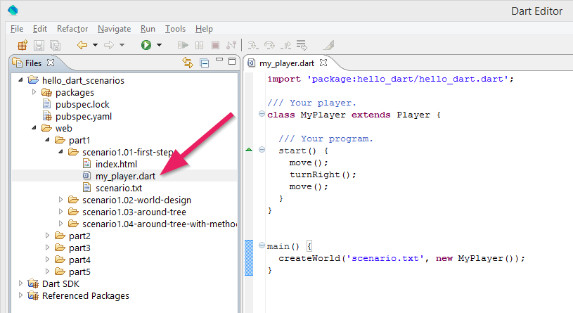

+++
title = "Installation"
date = 2015-05-01
description = "Installing Dart Editor. Loading the Hello Dart scenarios and starting a first Dart program."
image = "hello-dart.png"
prettify = true
comments = true

sidebarName = "<i class=\"fa fa-fw fa-cog\"></i> Installation"
pagingName = "<i class=\"fa fa-fw fa-cog\"></i>"
weight = 2

[[sidebars]]
header = "Links"
[[sidebars.items]]
text = "<i class=\"fa fa-fw fa-download\"></i> Dart Editor Download"
link = "https://www.dartlang.org/tools/download.html"
[[sidebars.items]]
text = "<i class=\"fa fa-fw fa-download\"></i> Hello Dart Scenarios"
link = "https://github.com/marcojakob/hello-dart/releases"
[[sidebars.items]]
text = "<i class=\"fa fa-fw fa-file-word-o\"></i> Page as Word File"
link = "/library/convert-web-page-to-word/"
+++

To start programming we need...

* the **Dart Editor** and
* the `Hello Dart` scenarios.

## Dart Editor Installation

1. Download the [Dart Editor here](https://www.dartlang.org/tools/download.html).
2. Unzip the downloaded files to your hard drive.

  <strong>Note:</strong> Dart Editor requires Java 6 or higher. [Download the JRE](http://www.oracle.com/technetwork/java/javase/downloads/), if needed. For other problems with the installation, see <a href="https://www.dartlang.org/tools/editor/troubleshoot.html" class="alert-link">Troubleshooting Dart Editor</a>.

### What's Included with Dart Editor?

***

  

    
  

  

    Dart Editor is a simple but powerful editor. You can conveniently create, edit, and manage Dart projects with it. 
  

***

  

    
  

  

    A special version of Chromium that includes the Dart VM. You can use Dartium to test and debug your Dart web applications. The Dart Editor will automatically open Dartium when you run your projects.
  

***

  

    
  

  

    The directory <strong>dart-sdk</strong> contains the Dart VM, standard libraries, and command-line tools.
  

***

## Starting Dart Editor

 Start the Dart Editor by double-clicking the executable file in the installation folder.

## Opening the `Hello Dart` Scenarios

1. Download the the `hello_dart_scenarios.zip` file from [Hello Dart Releases](https://github.com/marcojakob/hello-dart/releases) (use the latest version).  
2. Unzip the files to your computer.
3. In Dart Editor: Click on **File | Open Existing Folder...**. Choose the `hello_dart_scenarios` folder that you have just unzipped.
4. Use a double-click to open the file `my_player.dart` from the subfolder `web/part1/scenario1.01`.   

5. Click the *Run* button .

The Chromium browser should now automatically open with the first scenario:

### What's next?

&rarr; Continue with [Part 1](/library/hello-dart/part1/) to make your first steps in programming.

***

*Credits* 
<em class="small">
  [Planet Cute](http://www.lostgarden.com/2007/05/dancs-miraculously-flexible-game.html) images by Daniel Cook (Lostgarden.com), published under [CC BY 3.0](http://creativecommons.org/licenses/by/3.0/us/). 
[Oleg Yadrov](https://www.linkedin.com/in/olegyadrov) improved the "Planet Cute" images and was so kind to let me use them. The images were optimized with the great [TexturePacker](https://www.codeandweb.com/texturepacker).
</em>