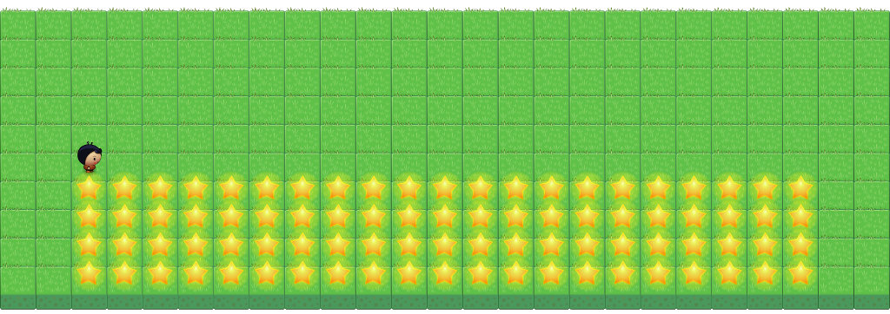
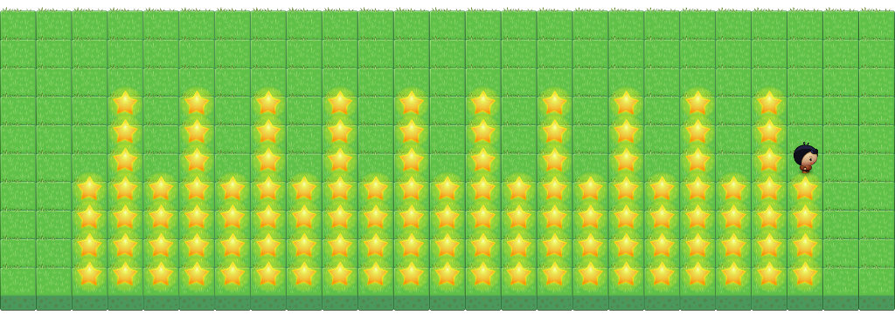
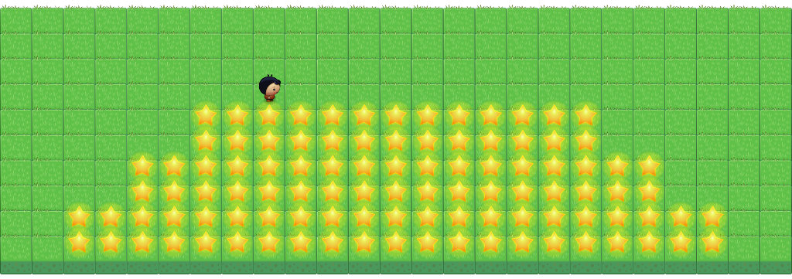

+++
title = "Teil 5: Funktionen"
date = 2015-01-21
description = "Wir erweitern unsere Kenntnisse über Funktionen und Methoden in Dart. Wir lernen, wie wir Funktionen mit Parametern und Rückgabewerten verwenden können."
image = "layered-cake.jpg"
prettify = true
comments = true
commentsIdentifier = "/library/hello-dart/de/part5/"
aliases = [ 
  "/library/hello-dart/de/part5/" 
]

pagingName = "5"
weight = 7

[[sidebars]]
header = "Lösungen"
[[sidebars.items]]
text = "<i class=\"fa fa-fw fa-check-square-o\"></i> Lösungen Teil 5"
link = "/de/library/hello-dart/part5/solutions/"

[[sidebars]]
header = "Links"
[[sidebars.items]]
text = "<i class=\"fa fa-fw fa-file-word-o\"></i> Seite als Word-Datei"
link = "/de/library/convert-web-page-to-word/"
+++

  

    
  

  

    

      <em>Es war einmal ein kleines Mädchen, das immer ein rotes Käppchen trug. Darum hiess es bei allen Leuten nur „Rotkäppchen". Eines Tages sagte die Mutter zu dem Kind: "Rotkäppchen, heute hat Deine Grossmutter Geburtstag. Back ihr doch ihren Lieblingskuchen, nimm eine Flasche vom guten alten Wein aus dem Keller, leg alles in einen Korb und geh sie besuchen."</em>
    

    
<strong>Helfen Sie Rotkäppchen beim Kuchenbacken! Gleichzeitig erweitern wir dabei unsere Kenntnisse über Funktionen.
    </strong>

  

## Funktionen mit Parametern

Über Parameter können einer Funktion Werte übergeben werden. So kann man bei folgender Funktion angeben, wie viele Schritte der Spieler gehen soll:

<pre class="prettyprint lang-java">
multiMove(int steps) {
  int i = 0;

  while (i &lt; steps)     {
    move();

    i = i + 1;
  }
}
</pre>

Um z.B. 5 Schritte zu gehen, wird beim Aufruf der Funktion der Wert 5 in der Klammer angegeben:

<pre class="prettyprint lang-java">
multiMove(5);
</pre>

Um eine Funktion mit mehreren Parametern aufzurufen, werden die Werte durch Kommas getrennt.

<pre class="prettyprint lang-java">
drawRectangle(21, 4);
</pre>

#### Erklärungen

1. Bei den bisherigen Programmen war es eher lästig, die Funktionen immer mit einem Klammerpaar `()` zu versehen. Nun wird klar, dass die bisher eingesetzten Funktionen nur Spezialfälle darstellten, bei denen kein Parameter übergeben wird.
2. In der Klammer wird der Parameter (hier `steps`) mit einem Typ angegeben (hier `int`). Mehrere Parameter werden durch Kommas getrennt. Beispiel:    
<pre class="prettyprint lang-java">
public void drawRectangle(int width, int height)
</pre>
3. Beim Aufruf einer Funktion wird der Wert in die Variable (hier `width` und `height`) kopiert.

  <strong>Wichtig:</strong> Wenn Funktionen innerhalb einer Klasse stehen (was meist der Fall ist), dann werden diese oft auch <strong>Methoden</strong> genannt!

### Kuchen backen

Wir wollen nun mit unserem Spieler für die Grossmutter einen Geburtstagskuchen "backen". Der Kuchen wird aus Sternen bestehen.

#### <i class="fa fa-rocket mg-t"></i> AUFGABE 5.01: Baking a Cake

 

Als Vorbereitung für das Backen sollen folgende Methoden zur Verfügung gestellt werden:

1. `turnAround()`   
Dreht den Spieler um 180 Grad.

2. `multiMove(int steps)`   
Der Spieler geht die Anzahl Schritte (steps) in die aktuelle Blickrichtung (siehe Beispiel im Theorieteil oben).

3. `putStars(int count)`   
Der Spieler legt die Anzahl (count) Sterne. Der erste Stern legt er an der aktuellen Position, die weiteren fortgesetzt in seine Blickrichtung.

Der Spieler soll mit Sternen ein Rechteck zeichnen, welches den Kuchen symbolisiert. 

Der Spieler startet in der Ecke unten links. Der Spieler soll nicht nur eine fixe Grösse eines Rechteckes zeichnen können, sondern ein Rechteck mit variabler Breite und Höhe! Der Funktionsaufruf `drawRectangle(21, 4)` soll demnach ein Rechteck mit der Breite 21 und der Höhe 4 erzeugen.

#### <i class="fa fa-rocket mg-t"></i> AUFGABE 5.02: Candles on Cake

 

Damit unser Kuchen auch wie ein Geburtstagskuchen aussieht, braucht er natürlich noch ein paar Kerzen. Erweitern Sie Ihr Programm um eine zusätzliche Funktion `drawCandles(int count)`, welche die angegebene Anzahl Kerzen auf den Kuchen setzt. 

## Funktionen mit Rückgabewerten

Über den Rückgabewert kann eine Funktion einen Wert als Ergebnis zurückliefern. So errechnet die folgende Funktion die angegebenen Zahl mal zwei und gibt das Resultat zurück:

<pre class="prettyprint lang-java">
int twoTimes(int number) {
  return 2 * number;
}
</pre>

Das Resultat kann entweder in eine Variable gespeichert oder direkt wie folgt verwendet werden:

<pre class="prettyprint lang-java">
multiMove(twoTimes(4));
</pre>

#### Erklärungen

1. Der Typ des Rückgabewerts (hier `int`) wird vor dem Namen der Funktion angegeben. Wenn die Funktion keinen Rückgabewert enthält, wird das meist mit `void` ausgedrückt.
2. Die Rückgabe eines Wertes in einer Funktion geschieht mit `return`, gefolgt vom Wert.

#### <i class="fa fa-rocket mg-t"></i> AUFGABE 5.03: Candles for Age

Wir möchten der Grossmutter **für jedes Jahrzehnt eine Kerze** auf den Kuchen stecken. Da Rotkäppchen nicht genau weiss, wie alt die Grossmutter wird, muss es zuerst ihre Mutter fragen.

Programmieren Sie eine Funktion `howOldIsGrandma()`, die das Alter der Grossmutter zurückgibt. Mit Hilfe dieser Funktion soll dann für jedes Jahrzehnt eine Kerze auf dem Kuchen platziert werden.

  <strong>Hinweis:</strong> Bei der Division von zwei Zahlen entsteht in Dart immer ein <code>double</code>. Damit wir wieder einen <code>int</code> erhalten, können wir die Funktion <code>toInt()</code> oder <code>round()</code> verwenden. Beispiel: <code>(5 / 3).toInt()</code>   

#### <i class="fa fa-rocket mg-t"></i> AUFGABE 5.04 (schwierig): Layered Cake

 

"Backen" Sie mit unserem Spieler eine Torte mit einer Schicht für jedes Jahrzehnt, das die Grossmutter über 50 ist. Jede Schicht soll zwei Zeilen haben und soll auf beiden Seiten um zwei Sternen nach innen gerückt sein. 

***

## Ende ... und wie weiter?

Erfahren Sie die [nächsten Schritte](/de/library/hello-dart/next/).

***

*Quellen* 
<em class="small">
[Planet Cute](http://www.lostgarden.com/2007/05/dancs-miraculously-flexible-game.html) Bilder stammen von Daniel Cook (Lostgarden.com), veröffentlicht unter [CC BY 3.0](http://creativecommons.org/licenses/by/3.0/us/). 
[Oleg Yadrov](https://www.linkedin.com/in/olegyadrov) hat die "Planet Cute" Bilder weiterentwickelt und mir zur Verfügung gestellt. Optimiert wurden sie mit dem grossartigen [TexturePacker](https://www.codeandweb.com/texturepacker). 
Einige Übungen in `Hello Dart` sind inspiriert von [Kara](http://www.swisseduc.ch/informatik/karatojava/). Kara wurde entwickelt von Jürg Nievergelt, Werner Hartmann, Raimond Reichert und anderen.
</em>