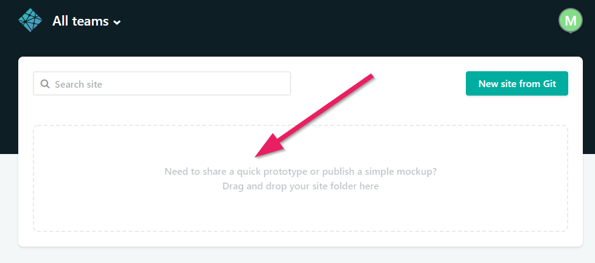
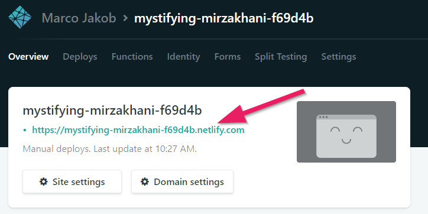
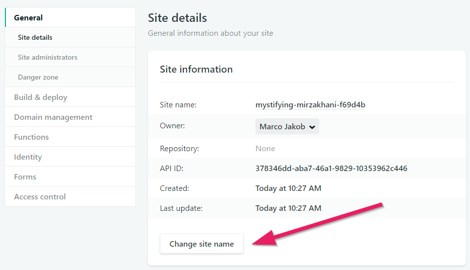
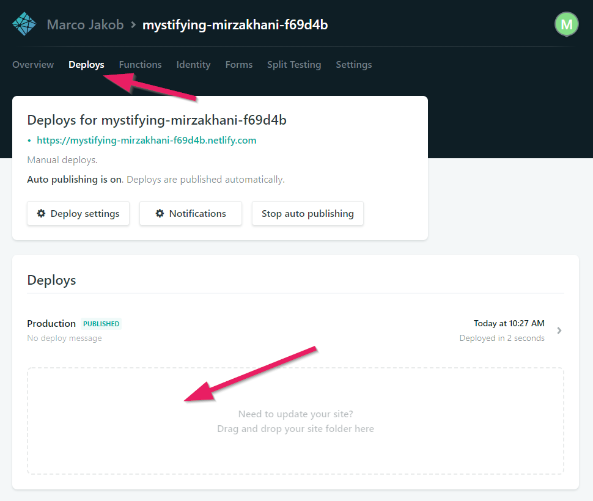

+++
title = "Teil 2: Webseite veröffentlichen"
date = 2018-08-10
description = "Lernen Sie, wie man eine Webseite live im Internet veröffentlicht."
image = "portfolio.de.png"
prettify =  true
comments =  true
commentsIdentifier = "/library/html-css/de/part2/"
aliases = [
  "/library/html-css/de/part2/"
] 
weight = 2
+++

Im ersten Teil haben wir unsere erste Webseite erstellt. Es wäre ja schade, wenn diese Webseite nur auf unserem Computer liegt und sie gar nie von jemand anderem angeschaut werden kann. Deshalb werden wir jetzt die Webseite gleich live ins Internet stellen.

<strong>Hinweis:</strong> Sie werden nicht von Beginn weg viele Besucher auf Ihrer Webseite haben. Denn solange Sie niemandem einen Link auf die Seite schicken oder den Link irgendwo veröffentlichen, wird kaum jemand einfach auf Ihre Seite stossen.

## Hosting

Was braucht es eigentlich, damit unsere Webseite im Internet aufgerufen werden kann? Wir brauchen einen **Server**, wo unsere Webseite gespeichert ist und eine **Adresse**, genannt URL, damit unsere Seite auf dem Server gefunden werden kann.

Es gibt zahlreiche Dienste, wo wir Speicherplatz auf einem Server mieten können. Solche Dienste nennt man [Hosting](http://de.wikipedia.org/wiki/Hosting). Wir schauen nun ein paar Möglichkeiten für ein (gratis) *Hosting* an. Mein aktueller Topfavorit ist **Netlify**.

### Hosting auf Netlify

[Netlify](https://www.netlify.com/) ist ein wunderbar einfacher Dienst, den ich sehr empfehlen kann. Mit Netlify ist es möglich, eine Website gratis zu hosten. So geht es:

1. Melden Sie sich an auf der [Netlify Webseite](https://www.netlify.com/). Klicken Sie dazu auf *Sign Up* und anschliessend auf *Email*. Anschliessen geben Sie Ihre E-Mail-Adresse und ein Passwort ein.

2. Sobald Sie angemeldet sind, können Sie einfach Ihren gesamten Webseitenordner (Ihren Portfolio-Ordner) in den dafür vorgesehenen Bereich ziehen:

3. Kaum zu glauben, aber das war's schon. Sobald die Seite hochgeladen ist, wurde für Sie eine URL generiert, unter welcher Ihre Seite aufgerufen werden kann. Klicken Sie auf diese URL und überprüfen Sie, ob die Seite korrekt angezeigt wird.

4. Um Ihre URL etwas zu verkürzen gehen Sie zu **Site settings**, klicken auf **Change site name** und geben einen beliebigen Namen eingeben.

5. **Für Updates:** Sobald Sie eine neue Version Ihrer Webseite veröffentlichen möchten, öffnen Sie das Menu **Deploys** und ziehen Sie den Ordner einfach erneut in das Feld mit dem Text **Drag and drop your site folder here**.

#### Eigene Domain

Irgendwann kommt der Zeitpunkt, wo Sie einen ganz eigenen Domainnamen, wie zum Beispiel `http://www.mein-super-name.ch`, möchten. Das Einzige, was sie bezahlen müssen, ist die Reservation der Domain bei einem beliebigen Domain Registrar. Dies kostet ca. 10$ pro Jahr. Das Hosting bei Netlify ist gratis.

Sobald Sie eine eigene Adresse reserviert haben, können Sie diese mit Netlify verknüpfen. Siehe dazu die Einstellungen unter **Domains**, **Add custom domain**. 

### Hosting auf GitHub

Wenn Sie schon etwas Erfahrung mit Programmieren haben, dann ist auch [GitHub](https://github.com) eine gute Möglichkeit für Webseiten-Hosting. GitHub ist eine Plattform, um die Zusammenarbeit unter Programmierern zu erleichtern.

Wenn man seine Website auf GitHub speichert, dann kann man entweder GitHub mit Netlify verknüpfen, damit eine solche Seite veröffentlicht werden kann oder man nutzt [GitHub Pages](https://pages.github.com/), den Dienst von GitHub selbst.

***

&rarr; Im nächsten Teil geht es darum, der Webseite etwas Style einzuhauchen. Weiter geht's also mit [Teil 3: Einführung in CSS](/de/library/html-css/part3/).
