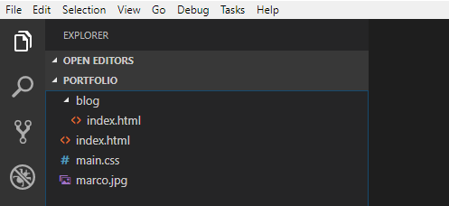
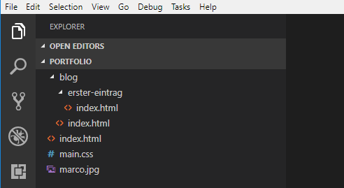
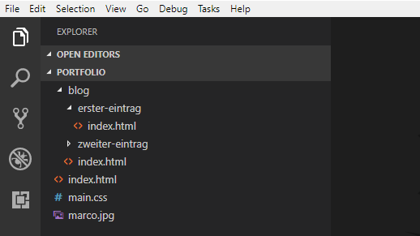

+++
title = "Teil 5: Blog und weitere Seiten"
date = 2014-08-13
updated = 2015-03-18
description = "Erstellen Sie eine Dateistruktur für mehrere Webseiten. Lernen Sie eine Struktur für einen Blog aufzustellen."
image = "portfolio.de.png"
prettify = true
comments = true
aliases = [
  "/library/html-css/de/part5/"
]
weight = 5
+++

Unser Portfolio hat bis hierhin nur eine Startseite. Die meisten *Websites* (gemeint ist damit der ganze Webauftritt) haben natürlich mehr als nur eine Seite. In diesem Teil werden wir weitere Seiten erstellen.

## Neue Seiten erstellen

Wir erstellen drei neue Seiten: Eine Seite für unseren eigenen **Blog**, eine für **Projekte** und eine für **Kontaktinformationen**.

Diese drei Seiten stellen unsere "Hauptseiten" dar. Das heisst, dass wir daran denken müssen, dass jeweils weitere Unterseiten dazukommen könnten. So wird es zum Beispiel im Blog später für jeden Blogeintrag eine eigenen Unterseite geben. Aus diesem Grund werden wir für diese drei Seiten **je einen eigenen Unterordner** erstellen. Das gibt uns eine gute Ordnung.

Damit bei einem Aufruf des Unterordners die jeweilige Hauptseite automatisch als erstes angezeigt wird, nennen wir alle Hauptseiten `index.html`.

Eine neue Seite zu erstellen ist einfach. Am besten kopieren Sie die bisherige `index.html`, damit Sie bereits die Grundstruktur haben. Dann müssen wir natürlich jeweils ein paar Anpassungen vornehmen.

**Wichtig:** Achten Sie darauf, dass Sie beim Benennen von Unterordnern und Dateinamen keine Umlaute, Sonderzeichen oder Leerschläge verwenden. Meistens wählt man auch nur Kleinbuchstaben. Sie können Wörter aber zum Beispiel durch ein Minus (`-`) trennen, wenn Sie möchten.

## Seite für den Blog

Erstellen Sie einen Unterordner in Ihrem *Portfolio*-Ordner namens `blog`. Kopieren Sie die Datei `index.html` in diesen Unterordner. Nun sollte Ihre Dateistruktur so aussehen:

Öffnen Sie nun die kopierte Datei `blog/index.html` in Ihrem Browser (wenn Sie den Brackets-Editor verwenden, klicken Sie auf den Blitz für die *Live-Vorschau*). Nun werden Sie merken, dass zwei Dinge nicht funktionieren:

1. Das Bild wird nicht angezeigt.
2. Die im CSS definierten Farben werden nicht übernommen.

Da wir uns in einem Unterordner befinden, stimmt jetzt die URL (oder auch Pfad genannt) nicht mehr. Damit das Bild angezeigt würde, müssten wir für das `src`-Attribut anstatt `marco.jpg` nun `../marco.jpg` angeben. Aber wahrscheinlich wollen wir nicht schon wieder das gleiche Bild auf der Blogseite. Also können Sie das gesamte `img`-Element entfernen.

Beim **CSS** ist es üblich, dass man die Regeln jeweils **für das gesamte Projekt** definiert. So ist es wichtig, dass wir die gleiche CSS-Datei auch in der Blogseite verwenden können. Dies erreichen wir, indem wir die URL ändern von `main.css` auf `/main.css`. Mit dem `/` springen wir in den Hauptordner zurück - egal, in welchem Unterordner wir uns gerade befinden. So sieht jetzt das gesamte link-Element aus:

##### blog/index.html

<pre class="prettyprint lang-html">
&lt;link rel="stylesheet" href="/main.css">
</pre>

Diese Änderung sollte dazu führen, dass das Styling vom CSS auch für die Blogseite übernommen wird.

Jetzt passen wir noch den Titel und Inhalt an:

##### blog/index.html - Blog Hauptübersicht

<pre class="prettyprint lang-html">
&lt;!DOCTYPE html>

&lt;html>
  &lt;head>
    &lt;meta charset="utf-8">
    &lt;link rel="stylesheet" href="/main.css">
    &lt;title>Blog - Web Portfolio von Marco&lt;/title>
  &lt;/head>
  &lt;body>
    &lt;h1 class="title">Blog&lt;/h1>

    &lt;p>Hier schreibe ich über alles, was mir beim Lernen von Webprogrammierung begegnet.&lt;/p>

    &lt;h2>Blogeinträge&lt;/h2>

    &lt;!-- Hier kommt eine Liste mit allen Blogeinträgen. -->

  &lt;/body>
&lt;/html>
</pre>

Im HTML-Code oben sehen Sie ein neues Element mit den Tags `<!--` und `-->`. Mit diesen Tags können wir in HTML einen **Kommentar** hinschreiben. Kommentare sind nur für uns als Programmierer gedacht und werden vom Browser ignoriert.

### Blogeintrag als Unterseite

Der Blog braucht natürlich noch Einträge. Wir erstellen für jeden Blogeintrag eine eigen HTML-Unterseite. Erstellen Sie einen Unterordner innerhalb des `blog`-Ordners mit dem Namen `erster-eintrag`. Kopieren Sie die Datei `blog/index.html` in diesen Ordner hinein.

Im Blogeintrag ändern wir den Inhalt wie folgt ab:

##### blog/erster-eintrag/index.html - Erster Blogeintrag

<pre class="prettyprint lang-html">
&lt;!DOCTYPE html>

&lt;html>
  &lt;head>
    &lt;meta charset="utf-8">
    &lt;link rel="stylesheet" href="/main.css">
    &lt;title>Erster Eintrag - Web Portfolio von Marco&lt;/title>
  &lt;/head>
  &lt;body>
    &lt;h1 class="title">Erster Eintrag&lt;/h1>
    &lt;p>02. August 2014&lt;/p>

    &lt;hr>

    &lt;p>Dies ist mein erster Eintrag im Blog.&lt;/p>

  &lt;/body>
&lt;/html>
</pre>

Auch hier ist ein neues HTML-Element enthalten (`hr`). Sie werden mit ausprobieren oder einer Internetsuche schnell herausfinden, was es bewirkt.

### Legen Sie los mit Blogeinträgen!

Ich empfehle Ihnen, dass Sie sofort damit anfangen, Blogeinträge zu schreiben. Sie könnten an jedem Tag, an dem Sie etwas Neues über Programmieren gelernt haben, einen kurzen Eintrag dazu schreiben. Ich notiere hier ein paar Gedanken, die Sie zu mögliche Inhalten inspirieren könnten:

* Was habe ich heute gelernt?
  * Screenshots einfügen
  * Links zu hilfreichen Seiten
* Welche Probleme sind mir begegnet?
* Wie habe ich diese Probleme gelöst?
* Woran sollte ich das nächste Mal arbeiten?

Mit solchen Blogeinträgen werden Sie beim Lernen von Programmierung viel schneller vorwärts kommen:

1. Sie werden sich bewusst, was Sie gelernt haben &rarr; mehr Motivation!
2. Sie können später in ihrer persönlichen Dokumentation etwas nachschlagen, z.B. Links zu hilfreichen Seiten.
3. Sie üben beim Schreiben der Einträge gleich die gelernten HTML-Elemente und CSS-Regeln.
4. Wenn Sie Ihre Website veröffentlichen, dann können Sie Ihren Blog auch anderen zugänglich machen. So können Sie Ihr Wissen mit anderen Teilen oder jemanden einladen, Ihnen bei einem Problem zu helfen.
5. Falls Sie Ihr Portfolio veröffentlichen, würde mich das sehr interessieren. Schreiben Sie dann irgendwo einen Kommentar mit dem Link!

*Also, warten Sie nicht und legen Sie los. Es lohnt sich!*

#### Zweiter Blogeintrag

  **Hinweis:** Erstellen Sie für jeden Blogeintrag einen eigenen Unterordner (mit einer `index.html`-Seite). So haben Sie eine gute Ordnung und können Bilder oder andere Dateien für den Blogeintrag im Unterordner ablegen.

## Seite für Projekte

Wenn wir später verschiedene Webseiten und Webapplikationen programmieren, wäre es natürlich nützlich, eine separate Seite zu haben, wo wir diese aufführen könnten. Wir bereiten schon mal eine Seite für unsere Projekte vor, jedoch noch ohne Inhalt.

Gehen Sie wie oben beim Blog vor und erstellen Sie einen Unterordner `projekte` mit einer Datei `index.html`:

##### projekte/index.html

<pre class="prettyprint lang-html">
&lt;!DOCTYPE html>

&lt;html>
  &lt;head>
    &lt;meta charset="utf-8">
    &lt;link rel="stylesheet" href="/main.css">
    &lt;title>Projekte - Web Portfolio von Marco&lt;/title>
  &lt;/head>
  &lt;body>
    &lt;h1 class="title">Projekte&lt;/h1>

    &lt;p>Hier finden Sie später meine Webprojekte.&lt;/p>

  &lt;/body>
&lt;/html>
</pre>

## Seite für Kontakt

Als letzte Hauptseite fügen wir eine Seite mit Kontaktinformationen hinzu. Erstellen Sie einen Unterordner `kontakt` mit einer Datei `index.html`.

**Wichtig:** *Überlegen Sie sich gut, welche Informationen Sie öffentlich machen wollen! Geben Sie zum Beispiel **nicht Ihre Haupt-E-Mail-Adresse an**, denn es kann sein, dass Sie nachher auf diese Adresse Spamnachrichten erhalten.*

##### kontakt/index.html

<pre class="prettyprint lang-html">
&lt;!DOCTYPE html>

&lt;html>
  &lt;head>
    &lt;meta charset="utf-8">
    &lt;link rel="stylesheet" href="/main.css">
    &lt;title>Kontakt - Web Portfolio von Marco&lt;/title>
  &lt;/head>
  &lt;body>
    &lt;h1 class="title">Kontakt&lt;/h1>

    &lt;p>
      Sie können mich kontaktieren per Mail: &lt;a href="mailto:spammails@gmx.ch">spammails@gmx.ch&lt;/a>
    &lt;/p>

    &lt;p>
      Marco Jakob&lt;br>
      Schweiz
    &lt;/p>
  &lt;/body>
&lt;/html>
</pre>

Bei der Adresse sehen Sie ein neues Element: ` `. Es bewirkt einen Zeilenumbruch. Beachten Sie auch den speziellen Link mit `mailto:` und der E-Mail-Adresse. Dieser Link bewirkt, dass das E-Mail-Programm geöffnet wird und gleich die Adresse ausgefüllt ist.

Nun haben wir bereits fünf HTML-Seiten:

## Wie weiter?

Was natürlich fehlt, ist eine Navigation, so dass man einfach zwischen diesen Seiten hin und her wechseln kann.

&rarr; Das nehmen wir gleich in Angriff im [Teil 6: Navigieren zwischen Seiten](/de/library/html-css/part6/).
