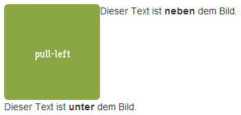
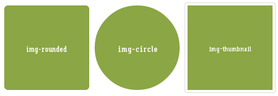

+++
title = "Bilder mit Bootstrap verwenden"
date = 2018-08-16
description = "Lernen Sie wie Bilder mit Bootstrap verwendet werden können. Bilder automatisch auf die Bildschirmgrösse anpassen, Bilder ausrichten, etc."
prettify = true
comments = true
commentsIdentifier = "/library/more-html-css/de/image-bootstrap/"
aliases = [ 
  "/library/more-html-css/de/image-bootstrap/" 
]
weight = 3

# Custom Sidebars
[[sidebars]]
header = "Links"
[[sidebars.items]]
text = "<i class=\"fa fa-fw fa-external-link\"></i> HTML & CSS Tutorial"
link = "/de/library/html-css/"
+++

In diesem Teil lernen Sie ein paar Tricks mit Bildern:

* [Responsive Bilder](#responsive-bilder) - passen sich auf Bildschirmgrösse an
* [Bilder ausrichten](#bilder-ausrichten) - zentrieren, links, rechts
* [Bilder mit Konturen](#bilder-mit-konturen) - Ecken abrunden, etc.

Für die meisten Beispiele wird [Bootstrap 3](http://holdirbootstrap.de/) verwendet.

Falls Sie Bootstrap in Ihrem Projekt noch nicht integriert haben, lesen Sie zuerst den Teil über <a href="/library/html-css/de/part7/" class="alert-link">Bootstrap Framework verwenden</a> aus dem HTML &lt; CSS Tutorial.

Bilder in eine Webseite einbinden gelingt am einfachsten wie folgt:

##### Bild einfügen

<pre class="prettyprint lang-html">
&lt;img src="mein-bild.png" alt="Mein Bild">
</pre>

Damit hat das Bild eine fixe Grösse. Man kann das Bild zwar verkleinern oder vergrössern mit einer CSS-Regel wie `width: 200px;`, aber das ist oft nicht sinnvoll. Man versucht nämlich immer die Downloadgrösse der Webseite zu optimieren. Wenn man also ein Bild mit 400px-Breite herunterlädt und es dann immer auf 200px verkleinert, dann ist das nicht optimal. Deshalb sollte man schauen, dass das **Bild immer die optimale Grösse hat**.

**Seitenbemerkung:** Es gibt Situationen, wo hochaufgelöste Bilder erwünscht sind, zum Beispiel für die Darstellung auf Retina-Displays. Wenn Sie diesen Zusatzaufwand für solche Geräte machen wollen, dann sollten Sie dafür eine JavaScript Bibliothek wie [retina.js](http://imulus.github.io/retinajs/) verwenden.

## Responsive Bilder

Wenn eine Webseite auf unterschiedlichen Bildschirmen angezeigt wird, dann kommt man nicht darum herum, diese auf kleinen Bildschirmen zu verkleinern.

Bootstrap 3 bietet hierzu eine CSS-Klasse `img-responsive`, welche Bilder automatisch auf die Bildschirmgrösse anpasst (lesen Sie über [Responsive Bilder in der Bootstrap Dokumentation](http://holdirbootstrap.de/css/#images-responsive)).

##### Responsive Bild einfügen

<pre class="prettyprint lang-html">
&lt;img src="mein-bild.png" alt="Mein Bild" class="img-responsive" >
</pre>

## Bilder ausrichten

### Zentrieren

Mit der CSS-Klasse `center-block` können Sie mit Bootstrap 3 Bilder zentrieren (siehe auch [center](http://holdirbootstrap.de/css/#helper-classes-center) in der Bootstrap Dokumentation):

##### Bild zentrieren

<pre class="prettyprint lang-html">
&lt;img src="..." alt="..." class="center-block">
</pre>

**Hinweis:** Die Klasse `center-block` kann auch zum Zentrieren von anderen HTML-Elementen gebraucht werden. Für Text und andere Inline-Elemente muss aber `text-center` verwendet werden (siehe <a href="http://holdirbootstrap.de/css/#type-alignment" class="alert-link">Ausrichtungsklassen</a> in der Bootstrap Dokumentation).

### Links und rechts ausrichten

Bilder können nach links und nach rechts ausgerichtet werden. Der Text fliesst dabei um die Bilder herum. Dazu werden sogenannte *Floats* verwendet (lesen Sie über [Floats](http://holdirbootstrap.de/css/#helper-classes-floats) in der Bootstrap Dokumentation).

##### Links ausrichten

<pre class="prettyprint lang-html">
&lt;img src="..." alt="..." class="pull-left">
</pre>

##### Rechts ausrichten

<pre class="prettyprint lang-html">
&lt;img src="..." alt="..." class="pull-right">
</pre>

#### Neue Zeile (Clearfix)

Beim Ausrichten nach links oder rechts werden alle nachfolgenden Elemente neben dem  Bild dargestellt. Falls man in einer neuen Zeile beginnen möchte, muss man die `clearfix`-Klasse verwenden. Diese Klasse wird meistens auf ein übergeordnetes `
`-Element angewendet (mehr Infos zu [clearfix](http://holdirbootstrap.de/css/#helper-classes-clearfix) in der Bootstrap Dokumentation):

<pre class="prettyprint lang-html">
&lt;div class="clearfix">
  &lt;img src="..." alt="..." class="pull-left">
  &lt;p>Dieser Text ist neben dem Bild.&lt;/p>
&lt;/div>
&lt;p>Dieser Text ist unter dem Bild.&lt;/p>
</pre>

#### Abstand neben dem Bild

Meist möchte man neben dem Bild einen Abstand zum Text oder zu einem anderen Inhalt. Dies erreicht man am einfachsten durch definieren eines `margins` im CSS.

Wenn wir im CSS eine Regel für das `img`-Element erstellen würden, dann würde diese auf alle Bilder auf der Webseite angewendet werden. Dies ist meist nicht sinnvoll. 

Für den Abstand rechts von einem Bild führen deshalb eine neue CSS-Klasse ein. Wir nennen diese `abstand-rechts`:

##### HTML für Abstand rechts

<pre class="prettyprint lang-html">
&lt;img src="..." alt="..." class="pull-left abstand-rechts">
</pre>

Im CSS definieren wir jetzt den Abstand.

##### CSS für Abstand rechts

<pre class="prettyprint lang-css">
.abstand-rechts {
  margin-right: 10px; 
}
</pre> 

Neben `margin-right` gibt es natürlich `margin-top`, `margin-bottom` und `margin-left`.

## Bilder mit Konturen

Bootstrap 3 bietet Möglichkeiten, um Bilder ganz einfach auf einer Webseite zu gestalten. Sie können die Ecken abrunden, einen Kreis ausschneiden oder einen dezenten Rahmen hinzufügen:

Mit den folgenden drei CSS-Klassen können Sie Ihren Bildern solche Konturen hinzufügen (weitere Infos unter [Bilder-Konturen](http://holdirbootstrap.de/css/#images-shapes) in der Bootstrap Dokumentation):

##### Konturen mit Bootstrap

<pre class="prettyprint lang-html">
&lt;img src="..." alt="..." class="img-rounded">
&lt;img src="..." alt="..." class="img-circle">
&lt;img src="..." alt="..." class="img-thumbnail">
</pre>

## Andere Artikel zu Bilder

Folgende Artikel zu Bilder könnte Sie auch interessieren:

* [Bilder gestalten](/library/more-html-css/de/image-editing/)
* [Kostenlose Bilder](/library/more-html-css/de/image-sources/)