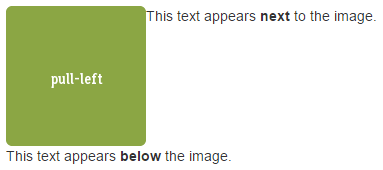

+++
title = "Images with Bootstrap"
date = 2018-08-16
description = "Learn some tricks on how to use images with Bootstrap."
prettify = true
comments = true
weight = 3

# Custom Sidebars
[[sidebars]]
header = "Links"
[[sidebars.items]]
text = "<i class=\"fa fa-fw fa-external-link\"></i> HTML & CSS Tutorial"
link = "/library/html-css/"
+++

In this part we will learn some tricks on how to use images with Bootstrap.

* [Responsive Images](#responsive-images) - automatically fit the screen size
* [Positioning Images](#positioning-images) - center, left align, right align
* [Image Shapes](#image-shapes) - Round edges, etc.

  If you haven't yet integrated Bootstrap in your project, please read <a href="/library/html-css/part7/" class="alert-link">how to use the Bootstrap Framework</a> in the HTML &amp; CSS Tutorial.

The easiest way to include images in a website is as follows.

##### Insert Images

<pre class="prettyprint lang-html">
&lt;img src="my-image.png" alt="My Image">
</pre>

## Optimal Image Size

The image above has a fixed size. Although, you can shrink or enlarge the image with a CSS rule like `width: 200px;`, this is often not what you want. You should always try to optimize the download size of your web page. If you let the user download a 400px wide image and display it at 200px it might be a waste of bandwidth.

**Side Note:** There are instances where larger images are desired, for example for high-resolution "retina" displays. If you want to go that extra mile for such devices you should use a JavaScript library like [retina.js](http://imulus.github.io/retinajs/).

## Responsive Images

When a web page is displayed on different screens you will have to shrink images on smaller screens.

Bootstrap 3 provides a CSS class `img-responsive` that will automatically adjusts images to fit the screen size (read about [responsive images in the Bootstrap documentation](http://getbootstrap.com/css/#images-responsive)).

##### Insert a responsive image

<pre class="prettyprint lang-html">
&lt;img src="my-image.png" alt="My Image" class="img-responsive" >
</pre>

## Positioning Images

### Center

With the CSS class `center-block` you can center images in Bootstrap (see [center content blocks](http://getbootstrap.com/css/#helper-classes-center) in the Bootstrap documentation):

##### Center an image

<pre class="prettyprint lang-html">
&lt;img src="..." alt="..." class="center-block">
</pre>

  **Note:** The class `center-block` can also be used to center any HTML elements. But for text and other inline elements you must use  `text-center` instead (see <a href="http://getbootstrap.com/css/#type-alignment" class="alert-link">alignment classes</a> in the Bootstrap documentation).

### Left and Right Align

Images can be aligned to the left or to the right. The text will then flow around the image. To do this we use the so-called *floats* (read about [floats](http://getbootstrap.com/css/#helper-classes-floats) in the Bootstrap documentation).

##### Float left

<pre class="prettyprint lang-html">
&lt;img src="..." alt="..." class="pull-left">
</pre>

##### Float right

<pre class="prettyprint lang-html">
&lt;img src="..." alt="..." class="pull-right">
</pre>

#### New Line after Float (Clearfix)

When floating to the left or right all following elements are displayed next to the image. If you want to start on a new line, you have to use the `clearfix` class. This class is usually added on a parent `
` element (more info about [clearfix](http://getbootstrap.com/css/#helper-classes-clearfix) in the Bootstrap documentation).

<pre class="prettyprint lang-html">
&lt;div class="clearfix">
  &lt;img src="..." alt="..." class="pull-left">
  &lt;p>This text appears next to the image.&lt;/p>
&lt;/div>
&lt;p>This text appears below the image.&lt;/p>
</pre>

#### Margin Around Image

Usually you will want some margin between the image and text or other content. A simple way to do this is to define `margins` in CSS.

If we created a rule for `img` elements in CSS this would be applied to all images on our entire website. This is usually not desired.

For the gap to the right of an image we therefore introduce a new CSS class called `gap-right`.

##### HTML for gap right

<pre class="prettyprint lang-html">
&lt;img src="..." alt="..." class="pull-left gap-right">
</pre>

Im CSS definieren wir jetzt den Abstand.

##### CSS for gap right

<pre class="prettyprint lang-css">
.gap-right {
  margin-right: 10px; 
}
</pre> 

There are also `margin-top`, `margin-bottom`, and `margin-left` if you need a gap in any other direction.

## Image Shapes

Bootstrap 3 provides ways for some simple images styles. You can round the corners, cut out a circle or add a subtle frame.

You can add the following three CSS classes to your images (see [image shapes](http://getbootstrap.com/css/#images-shapes) in the Bootstrap documentation).

##### Image Shapes with Bootstrap

<pre class="prettyprint lang-html">
&lt;img src="..." alt="..." class="img-rounded">
&lt;img src="..." alt="..." class="img-circle">
&lt;img src="..." alt="..." class="img-thumbnail">
</pre>

## Other Articles for Images

The following articles about images might also be interesting to you:

* [Image Editing](/library/more-html-css/image-editing/)
* [Free Image Sources](/library/more-html-css/image-sources/)